---
tags: Linux Kernel Internals, 作業系統
---

# Linux 核心設計: Scheduler(5): EEVDF Scheduler/1


## 回顧 CFS

CFS 在設計上最大的目標即名稱中提到的 "fair" -- 公平。排程器會追蹤每個 process 的已運行時間，並根據各自的權重來確保它們公平的共享 CPU 資源。保證 CPU 資源的公平性固然對於排程很重要，然而除此之外，CFS 還是存在其他可改進的地方。例如，process 在 CPU 之間的移動除了考慮 CPU 的負載平衡和公平性，也應最大程度的發揮 cache 的價值。或者在電源管理層面上，排程器可能也需有能力在 throughput 和省電之間做出取捨，在 [Arm big.LITTLE](https://en.wikipedia.org/wiki/ARM_big.LITTLE) 等類似的混合架構上更是讓排程器的需求更加[複雜](https://lwn.net/Articles/909611/)。

一個重要的議題是: CFS 主要著眼於以權重方式將 CPU 時間公平分配，但對延遲要求的處理卻不夠完善。舉例來說，有些任務的性質上並不需要大量的 CPU 時間，但一旦有需求時，則期望可以盡快獲得之。反之，有些任務雖然對 CPU 需求很大，但必要的時候可以等待。而 CFS 中的 nice 值僅能賦予任務更多 CPU 時間，卻無法表達任務對獲得 CPU 資源之延遲的期待。既便在 CFS 中針對延遲敏感的任務是可以選擇 realtime class(`rt_sched_class`)，但後者是屬於 privileged 的選項，意味著過度的使用之反而會造成系統其他部分的不良影響。

## 何謂 EEVDF?

EEVDF 的設計源自於 [Earliest Eligible Virtual Deadline First : A Flexible and Accurate Mechanism for Proportional Share Resource Allocation](https://citeseerx.ist.psu.edu/document?repid=rep1&type=pdf&doi=805acf7726282721504c8f00575d91ebfd750564) 這篇論文。讓我們簡單理解 EEVDF 的想法: 想像有 5 個 process 共享一個 CPU 的情境，則 CPU 時間被根據 nice value 按照對應的比例分配，這點與 CFS 的想法相同。假設 process 的 nice 值相同，那麼經過 1 秒鐘後，理想情況下每個 process 預期都各自使用了 200ms。不過實際上因為各種原因，每個 process 得到的時間可能多少偏移 200ms 一點。對此 EEVDF 計算實際得到之時間和 200ms 的差距，這個差異值稱為 "lag"。藉此，EEVDF 知道 lag 值為正的 process 與其他人相比得到的 CPU 時間更少，則之後它將比起 lag 為負的 process 被更早的排程。

只有一個 process 計算得到的 lag 大於或等於零時，才被視為符合資格，反之，任何 lag 為負者都沒有資格運行。對於不符資格的 process，因為要隨著時間前進，其有權獲得的時間才會變多，要等到其有權獲得的時間時趕上實際獲得的時間後，它才能再次獲得資格。這段時間差被稱為 "eligible time"。綜上所述，如何正確且精準的計算 lag 即為 EEVDF 演算法中的一大關鍵。

另一個 EEVDF 中的重要之處是 "virtual deadline" 的概念。這代表著 process 可以獲得應得的 CPU 的最早時間，可以通過將 process 分配到的 time slice 加上 eligible time 來得到。而 EEVDF 的精神即是挑選 virtual deadline 最早的 process。

在這個框架下，排程器在分配 time slice 考慮 latency-nice 值: latency-nice 較低的 process 表示對於延遲要求嚴格，會獲得較少的 time slice，而對延遲較不關心的 process 的  latency-nice 較高，並得到較長的 time slice。注意到兩個 process 得到的 CPU 時間是相同的，只是 latency-nice 低的是以多個短的 time slice 來得到這個總量， latency-nice 高者則是以少但是長的 time slice 取得。

```mermaid
gantt
    title time
    dateFormat DD
		axisFormat %d
        section process A
            tA_1 : 01, 1d
            tA_2 : 04, 1d
            tA_3 : 05, 1d
            tA_4 : 08, 1d
        section process B
            tB_1 : crit, 02, 2d
            tB_2 : crit, 06, 2d
```


> 如圖，process A 和 B 的時間總量都是 4 個單位，但 process A 以較短的 time slice 來得到之

前面我們說過 virtual deadline 是將 time slice 加上 eligible time 的總和，因此 time slice 短就意味著 virtual deadline 早，也就可以獲得更低的排程延遲。

## EEVDF 論文閱讀

節錄 [Earliest Eligible Virtual Deadline First : A Flexible and Accurate Mechanism for Proportional Share Resource Allocation](https://citeseerx.ist.psu.edu/document?repid=rep1&type=pdf&doi=805acf7726282721504c8f00575d91ebfd750564)。

### Introduction

> Generally, these schedulers fall in two categories: proportional share and real-time based schedulers

proportional share 以權重方式等比分配資源，而 real-time 則重視每個 client 在時限前獲得資源並有所進展。

> In this paper we propose a new scheduler (called Earliest Eligible Virtual Deadline First (EEVDF)which, while retaining all the advantages of the proportional share schedulers, provides strong timeliness guarantees for the service time received by a client. In this way, our algorithm provides a unied approach for scheduling continuous media, interactive and batch applications.

一般的 real-time scheduler 在多媒體(multimedia)或者互動式(interactive) 一類符合 event-driven model 的應用上表現得較好，但其嚴格的時間限制導致在 batch 應用的支援不佳。反之 proportional share scheduler 在重視低延遲的多媒體和互動式應用上存在不足。而 EEVDF 嘗試提出一種可以適用任何類型的統一方法。

### Assumptions

> Due to quantization, in a system in which the resource is allocated in discrete time quanta (as it is in ours), it is not possible for a client to always receive exactly the service time it is entitled to. The difference between the service time that a client should receive at a time t, and the service time it actual receives is called service time *lag*.

process 預期得到的時間和實際得到的時間會有差距，因為包含 process 間的切換、建立新的 prcess 等等 Scheduler 相關的演算法都會佔據額外時間。而這個時間差叫做 lag。

### The EEVDF Algorithm

* $w_i$ 表示第 $i$ 個 client 之 weight
* $r^{(k)}_i$ 表示任務 i 第 k 次 request 的時間長度
* A(t) 表示在時間 t 時所有 client 的集合
* $f_i(t) = \frac{w_i}{\sum_{j\in A(\tau)}w_j}$ 表示 client $i$ 在時間 $t$ 可以得到的時間比例
* $S_i(t_0,t) = \int_{t_0}^{t_1}f_i(\tau)d\tau$ 表示 client $i$ 在 $[t_0, t_1]$ 預期能得到的時間
* $s_i(t^i_0, t)$ 表示第 $i$ 個 client在 $[t^i_0, t]$ 時間區間內實際得到的時間
* $lag(t) = S_i(t^i_0,t) - s_i(t^i_0, t)$
* $V(t) = \int_0^t \frac{1}{\sum_{j\in A(\tau)} w_j}d\tau$ 表示時間 t 對應的 virtual time，可以看到 virtual time 與時間的關係隨著 client 的數量和各自的 weight 變動
* $ve^{(k)}_i$ 表示任務 i 進行第 k 次 request 時的 virtual eligible time。
* $vd^{(k)}_i$ 表示任務 i 進行第 k 次 request 時的 virtual deadline。


$$
ve^{(1)} = V(t^i_0) \\
$$

$$
vd^{(k)} = ve^{(k)} + \frac{r^{(k)}}{w_i} \\
$$

$$
ve^{(k + 1)} = vd^{(k)}
$$

* 一個 eligible 的 client 表示擁有 postive lag，即實際得到的時間不足預期
* deadline 是 client 應該完成 request 的最晚時間

:::info
完整的名詞概念定義和對應計算式可以參照原始論文的敘述
:::

這裡透過論文中的範例來解釋:


假設有兩個 client，各自的 weight 都是 2($w_1 = w_2 = 2$)，要求的時間則是 $r_1 = 2, r_2 = 1$。並令 time quantum 為 1。

* t = 0 時，只有 client 1 做 request，當下的 $ve^1_1 =0$ $vd^1_1 = ve^1_1 + 2/2 = 1$
* t = 1 時，$V(1) = \int_0^1 \frac{1}{\sum_{j\in A(\tau)} w_j}d\tau = \int_0^1 \frac{1}{2}d\tau = 0.5$
* t = 1 時，client 2 加入競爭，則此時對 client 2 $ve^1_2 = V(1) = 0.5$, $vd^1_2 = ve^1_2 + 1 / 2 = 1$
    * 由於 client 1 和 2 的 deadline 相同，可以任意挑選其中一個獲得時間
    * 假設 t = 1 時 client 2 成功競爭到資源，則下個 time quantum(t = 2)時足夠讓 client 2 完成該次 request
    * 此時 virtual time 的增加速率從 $1/w_1$ 變成 $1/(w_1 + w_2)$
* t = 2 時，client 2 第一個 request 完成，接著做第二個 request  $ve^2_2 =vd^1_2 = 1$，$vd^2_2 =ve^2_2 + 1/2=1.5$
    * 由於 $ve^2_2$ > 當前的 virtual time，只有 client 1 可以繼續 request
* t = 3 時，client 1 完成，可以做進行下一個 request $ve^2_1 =vd^1_1 = 1$，$vd^2_1 =ve^2_1 + 2/2 = 2$
    * 由於 client 2 的 deadline 較早，選擇 client 2

依此規則，我們可以判斷每個 time quantum 要分配給何者。

### Fairness in Dynamic Systems

> In an idealized fluid-flow system, supporting dynamic operations is trivial since at any moment of time the lag of any active client is zero. Unfortunately, in a system in which the service time is allocated in discrete time quanta, this is no longer true. 

在真實場景中，新的 client 加入或離開競爭，或者改變自身的 weight 等行為都會導致前述的 "lag"。在 EEVDF 中，公平性是藉由把 lag 考量進 virtual time 的計算中來滿足。


如上圖，假設三個 client 在 $t_0$ 時存在且此時沒有 lag，而在時間 t 時 client 3 離開競爭的行列。則在時間 t 時 client i 的 lag 為

$$
lag_i(t) = S_i(t_0,t) - s_i(t_0, t) \\
  = \int_{t_0}^{t_1}f_i(\tau)d\tau - s_i(t_0, t) \\
  = w_i \frac{t - t_0}{w_1 + w_2 + w_3} - s_i(t_0, t) -- (1)
$$

EEVDF 設計上在有 client 存在的狀況下，排程過程中不允許出現 resource idle。則在 $[t_0, t)$ 時間中，client 1 和 client 2 實際獲得的時間總和應為 $t - t_0 - s_3(t_0, t)$。那麼假設 $t^+$ 是 client 3 離開競爭的瞬間，且 $t^+ -> t$。則對於 client 1 和 client 2:

$$
S_i(t_0, t^+) = (t - t_0 - s_3(t_0, t)) \frac{w_i}{w_1 + w_2} -- (2)
$$

而根據前面的計算式

$$
lag_3(t) = w_3 \frac{t - t_0}{w_1 + w_2 + w_3} - s_3(t_0, t) \\
s_3(t_0, t) =  w_3 \frac{t - t_0}{w_1 + w_2 + w_3} - lag_3(t) -- (3)
$$

將 (3) 代入 (2)

$$
S_i(t_0, t^+) = (t - t_0 - ( w_3 \frac{t - t_0}{w_1 + w_2 + w_3} - lag_3(t))) \frac{w_i}{w_1 + w_2} \\
= (t - t_0 + \frac{-w_3t + w_3 t_0}{w_1 + w_2 + w_3}) * \frac{w_i}{w_1 + w_2} + w_i\frac{lag_3(t)}{w1 + w2} \\
= (\frac{w_1 + w_2t - w_1t_0 - w_2t_0}{w_1 + w_2 + w_3}) * \frac{w_i}{w_1 + w_2} + w_i\frac{lag_3(t)}{w1 + w2} \\
= (\frac{(w_1 + w_2)(t - t_0)}{w_1 + w_2 + w_3}) * \frac{w_i}{w_1 + w_2} + w_i\frac{lag_3(t)}{w1 + w2} \\
= (\frac{(t - t_0)}{w_1 + w_2 + w_3}) * w_i + w_i\frac{lag_3(t)}{w1 + w2} \\
= w_i(V(t) - V(t_0)) + w_i\frac{lag_3(t)}{w1 + w2}
$$

在算式中，我們可以看出當 client 3 離開時，EEVDF 會使得 client 1 和 client 2 按比例分攤 client 3 造成的 lag。

總結而言，當 client j 在時間 t 離開競爭，則 virtual time 的更新方式為:

$$
V(t) = V(t) + \frac{lag_j(t)}{\sum_{i\in{A(t^+)}}w_i} -- (4)
$$

在同樣概念下，當 client j 在時間 t 加入競爭，則 virtual time 的更新方式為:

$$
V(t) = V(t) - \frac{lag_j(t)}{\sum_{i\in{A(t^+)}}w_i} -- (5)
$$

權重的變更可以視為一個 client 推出競爭後又重新加入。假設在時間 t client j 的權重從 $w_j$ 變成 $w_j^{'}$:

$$
V(t) = V(t) + \frac{lag_j(t)}{\sum_{i\in{A(t^+)}}w_i - w_j}  + \frac{lag_j(t)}{\sum_{i\in{A(t^+)}}w_i + w_j^{'}} -- (6)
$$

另一個要考慮的問題是當一個 lag 為非 0 的 client 離開競爭後又重回競爭行列，該如何考慮其此時的 lag? 換個問法，一個 client 離開競爭時 lag 為正值的情形而言(實際得到的時間小於預期得到的)，是否該在其重回隊列時對其進行補償? 實際上這並沒有確切的答案，假設我們不做補償，那麼損失的時間會隨著時間周期的進行一直累積，最後產生大量的缺時。反之，假設我們決定在 client 重新加入時進行補償，這卻反而阻礙其他 client 的進行。舉個例子說明: 假設在時間 t 之前有兩個 active client 1 和 2，並且在時間 t client 2 退出競爭並有正的 lag。接下來，在隨後的時間 t0 client 2 重新加入競爭，而另一個 client 3 這時也在競爭中，而此時 client 1 不再活動。那麼補償的時間只能間接從 client 3 來提取了，這種做法對 client 3 反而就不公平了。

### Algorithm Implementation

前面我們說明了 client 重新加入是否該進行補償是沒有簡單的做法的，而論文對此提出三種策略。

* 策略 1: client 被允許在任意時刻加入、退出或更改權重。假設 client 在時間 t 離開，在 t' 時間返回，則 $lag(t) = lag(t')$，而 virtual time 會在發生加入/離開/更改權重時用 (4), (5), (6) 來更新 virtual time。
* 策略 2: 類似策略 1，但 client 離開時的 lag 不會在重新加入後補償或懲罰會來，也就是重新加入後的 lag = 0。
* 策略 3: client 只有在其 lag 為 0 的時候才被允許做加入/離開/更改權重。因此 virtual time 也就不需要在做這些動作時去更新。不過這樣要怎麼確保 lag 為 0 就是一個難題。詳細可以看原論文
    * 假設 client 想離開時其 lag 為負(得到時間比預期的多)，則我們想辦法延遲離開的時間來迫使 lag 為 0。這可以透過做出一個時間為 0 的 request 達成。由於且 request 在變得 eligible 之前不能被處理，加上因為 request lengeth 為 0 時 $ve == vd$，則可以得知 deadline 一到這 request 就會被處理並馬上完成。
    * 呈上所述現在只要考慮 lag 非負的情況，論文中證明了 EEVDF 保證 request 在其 deadline 之後的一個 time quantum 內得到滿足，則在 lag 變成 0 的一刻和 request 滿足的時刻之間，不會有其他的 time quantum。基於 time quantum 內沒有 event(join/leave/reweight) 發生的前提(論文中做的假設)，因此在 time quantum 到期後更新 virtual time，還是等到 lag 變為零，沒有區別(*)。

:::danger
老實說看完這段還是不太確定 lag 非負的情況具體要怎麼做?
:::

### Appendix A: Example: Implementation of Strategy 1

為求簡單，假設每個 request 只能做 1 個 time quantum(`QuantumSize`)。clients 的 pending request 以一個樹狀的資料結構 `ReqTree` 維護，這樹主要支援三個操作 insertion (`insert_req`), deletion (`delete_req`), 以及取得擁有最早 virtual deadline 的 eligible request (`get_req`)。

```cpp
/* join competition */
void join(client_struct *client)
{
    /* update total weight of al l active clients */
    TotalWeight += client->weight;
    /* update virtual time according to client lag */
    VirtualTime = get_current_vt() - client->lag/TotalWeight;
    /* issue request */
    client->req->ve = VirtualTime;
    client->req->vd = req->ve + QuantumSize/client->weight;
    insert_req(client->req);
}
```
當一個 client 想加入競爭時可以透過 join:
* scheduler 計算所有等待 request 完成的 client 之權重總和，方便後續更新 virtual time 的使用
* 根據公式 (5) 去更新 `VirtualTime`
* $ve$ 和 $vd$ 前面也提過如何計算
$$
ve^{(1)} = V(t^i_0) \\
vd^{(k)} = ve^{(k)} + \frac{r^{(k)}}{w_i} \\
ve^{(k + 1)} = vd^{(k)}
$$
* `insert_req` 將 client 加入到 `ReqTree` 之中

```cpp
/* leave competition */
void leave(client_struct *client)
{
    /* update total weight of all active clients */
    TotalWeight -= client->weight;
    /* update virtual time according to client lag */
    VirtualTime = get_current_vt() + client->lag/TotalWeight;
    /* delete request */
    delete_req(client->req);
}
```
當一個 client 想退出競爭時可以透過 leave:
* scheduler 計算所有等待 request 完成的 client 之權重總和
* 根據公式 (4) 去更新 `VirtualTime`
* `delete_req` 將 client 從 `ReqTree` 之中移除

```cpp
/* change client weight */
void change_weight(client_struct *client, int new_weight)
{
    /* partial update virtual time according to client lag */
    VirtualTime = get_current_vt() + client->lag/(TotalWeight - client->weight);
    /* update total weight of all active clients */
    TotalWeight += new_weight - client->weight;
    /* update client's weight */
    client->weight = new_weight;
    /* update virtual time */
    VirtualTime -= client->lag/TotalWeight;
}
```
* 更新 client 的 weight
* 根據公式 (6) 更新 virtual time

```cpp
/* dispatch function */
void EEVDF_dispatch()
{
    int used;
    /* get eligible request with earliest virtual deadline */
    req = get_req(ReqTree, get_curreent_vt());
    /* allocate resource to client with earliest eligible virtual dead line */
    used = allocate(req->client);
    /* update client's lag */
    update_lag(client, used);
    /* current request has been fullfiled; delete it */
    delete_req(ReqTree, req);
    /* issue new request */
    client->req->ve += used/client->weight;
    client->req->vd = client->req->ve + QuantumSize/client->weight;
    insert_req(client->req);
}
```
* `get_req` 根據 earliest virtual deadline 找出適合的下個 req，並將資源分配給他(`allocate`)
* `update_lag` 即  $lag(t) = S_i(t^i_0,t) - s_i(t^i_0, t)$
* 將 req 從樹中移除後，更新 $ve$ 和 $vd$，進行新一輪的 request

### Appendix B. Request Data Structure

> The data structure is based on an augmented binary search tree and supports the following operations: insertion (`insert_req`), deletion (`delete_req`), and finding the eligible request with the earliest virtual deadline (`get_req`).


樹狀結構如圖。以 root 為例:
* 15 表示子樹(表含自己和所有後代)中最小的 virtual deadline 是 15
* 10 表示自己的 virtual eligible time $ve$
* 25 表示自己的 virtual deadline $vd$
* 樹的 key 是 $ve$

#### `get_req`

```cpp
/* get eligible request with earliest dead line */
req_struct *get_req(req_struct *root, time_v vtime)
{
    req_struct *node = root, *st_tree = NULL, *path_req = NULL;
    while (node) {
        if (node->ve <= vtime) {
            /* update node with earliest dead line along path. */
            if ((!path_req) || (path_req->vd > node->vd))
                path_req = node;
            /* update root of subtree containing earliest dead line */
            if ((!st_tree) || (node->left && st_tree->min_vd > node->left->min_vd))
                st_tree = node->left;
            node = node->right;
        } else
            node = node->left;
    }
    
    /* check whether node with earliest dead line was along path */
    if ((!st_tree) || (st_tree->min_vd >= path_req->vd))
        return path_req;
    /* return node with earliest dead line from subtree */
    for (node = st_tree; node; ) {
        /* if node found, return it */
        if (st_tree->min_vd == node->vd)
            return node;
        if (node->min_vd == node->left->min_vd)
            node = node->left;
        else
            node = node->right;
    }
}
```
* 輸入為當前的 vtime
* 輸出為符合的 eligible request
* 從 root 開始，如果 `vtime` >= 當下 node 的 $ve$，則往樹的右子樹搜尋，否則往左
* 在搜尋路徑上會先找到 $ve$ 符合的所有 subtree，但目標是其中 $vd$ 最小的，擁有最小 $vd$ 的節點必然在是搜尋路徑上最小的 $vd$ 節點，或者搜尋路徑上節點的左子樹中

#### `insert_req`
```cpp
/* insert new request */
void insert_req(req_struct *root, req_str *req)
{
    req_struct *node = root;
    while (node) {
        /* update min vd of current node */
        if (node->min_vd > req->vd)
            node->min_vd = req->vd;
        if (node->ve < req->ve) {
            if (!node->right) {
                /* insert new request as right child */
                node->right = req;
                req->parent = node;
                return;
            }
           node = node->right;
        } else {
            if (!node->left) {
                /* insert new request as left child */
                node->left = req;
                req->parent = node;
                return;
            }
                node = node->left;
        }
    }
}
```

標準的 binary tree insert，區別只在要更新路徑的 minimum $vd$。

#### `delete_req`

```cpp
/* update min_vd fields of all ancestors of node */
void backward_update(req_struct *node, req_struct *root)
{
    do {
        node->min_vd = node->vd;
        /* check for right child */
        if (node->right && node->min_vd > node->right->min_vd)
            node->min_vd = node->right->min_vd;
        /* check for left child */
        if (node->left && node->min_vd > node->left->min_vd)
            node->min_vd = node->left->min_vd;
    } while ((node != root) && (node = node->parent))
}
```

刪除時也需考慮 minimum $vd$ 的更新，`backward_update` 從要被刪除的節點開始並一路到 root，將需要更新的 minimum $vd$ 進行調整。更新的方法是透過本身和左右子樹的 $vd$ 判斷其中的最小值。

```cpp
/* delete specified request */
req_struct *delete_req(req_struct *root, req_struct *req)
{
    req_struct *child, *succ;
    if (!req->right || !req->left) { /* cases (i) and (ii) */
        /* get node's child, if any */
        child = get_child(req);
        /* remove node form tree */
        if (child)
            child->parent = node->parent;
        if (req == root)
            return child;
        if (req->parent->left == req)
            req->parent->left = child;
        else
            req->parent->right = child;
        /* update min vd of node's ancestors */
        backward_update(parent, root);
    } else { /* case (iii) */
        /* get node's successor */
        succ = get_succesor(req);
        /* delete node's successor from tree */
        req->right = delete_req(req->right, succ);
        /* swap node with its successor */
        swap_node(succ, req);
        /* update min vd of node's ancestors */
        backward_update(req, root);
    }
    return root;
}
```


刪除包含了上述三種情況，其中 case (i) 和 (ii) 比較簡單，只需將原節點移除並看使否讓唯一的 child 繼承其原本位置就可以了。case (iii) 較為複雜，首先找到 succesor(key 大於本節點的者之中擁有最小 key 的節點)，將其後移除後取代原節點的位置。

## Main patches

下面嘗試針對 Peter Zijlstra 在信件中提出的 [patch series](https://lore.kernel.org/lkml/20230531115839.089944915@infradead.org/) 逐一做探討。方便對應，連結則對應到 v6.6-rc4 版本的程式碼。

### [PATCH 01/15] sched/fair: Add avg_vruntime

```diff
@@ -554,6 +554,9 @@ struct cfs_rq {
 	unsigned int		idle_nr_running;   /* SCHED_IDLE */
 	unsigned int		idle_h_nr_running; /* SCHED_IDLE */
 
+	s64			avg_vruntime;
+	u64			avg_load;
+
 	u64			exec_clock;
 	u64			min_vruntime;
```

EEVDF 引入兩個新的參數: `avg_vruntime` 和 `avg_load`，兩者的代表意義可以在以下註解一探究竟。

```cpp
/*
 * Compute virtual time from the per-task service numbers:
 *
 * Fair schedulers conserve lag:
 *
+ *   \Sum lag_i = 0
 *
 * Where lag_i is given by:
 *
 *   lag_i = S - s_i = w_i * (V - v_i)
 *
 * Where S is the ideal service time and V is it's virtual time counterpart.
 */
```

EEVDF 中滿足 $\sum_i lag_i = 0$，即所有任務的 lag 之合為 0。每個任務的 lag 值計算方式為 $lag_i = S_i - s_i = w_i * (V - v_i)$。其中 $S_i$ 代表理想上應得的時間，$s_i$ 則是實際應到的時間。$V$ 則表示應得的 virtual time(在 virtual time 的世界中，所有任務應得的 $V$ 是相同的)。$v_i$ 是實際得到的 virtual time。

:::warning
$lag_i = S - s_i$ 不太正確，應為 $lag_i = S_i - s_i$，可參見 [這裡](https://lore.kernel.org/lkml/20231011130851.GF6337@noisy.programming.kicks-ass.net/) 的討論串
:::

```cpp
 /* Therefore:
 *
 *   \Sum lag_i = 0
 *   \Sum w_i * (V - v_i) = 0
 *   \Sum w_i * V - w_i * v_i = 0
 *
 * From which we can solve an expression for V in v_i (which we have in
 * se->vruntime):
 *
 *       \Sum v_i * w_i   \Sum v_i * w_i
 *   V = -------------- = --------------
 *          \Sum w_i            W
 *
 * Specifically, this is the weighted average of all entity virtual runtimes.
 */
```

則可以展開求得以下式子:

$$
\sum_i lag_i \\
    = \sum_i  w_i * (V - v_i) \\
    = \sum_i  w_i * V - w_i * v_i = 0
$$

移項後，可求得 $V$ 為:

$$
V = \frac{\sum_i w_i * v_i}{\sum_i w_i} = \frac{\sum_i w_i * v_i}{W}
$$

這裡 W 表示所有任務的權重之和。從式子中也可以看出 $V$ 就是所有任務已歷經的 vitual runtime 之 weight average。

```cpp
 /*
  * [[ NOTE: this is only equal to the ideal scheduler under the condition
  *          that join/leave operations happen at lag_i = 0, otherwise the
  *          virtual time has non-continguous motion equivalent to:
  *
  *	      V +-= lag_i / W
  *
  *	    Also see the comment in place_entity() that deals with this. ]]
  *
  * However, since v_i is u64, and the multiplcation could easily overflow
  * transform it into a relative form that uses smaller quantities:
  *
  * Substitute: v_i == (v_i - v0) + v0
  *
  *     \Sum ((v_i - v0) + v0) * w_i   \Sum (v_i - v0) * w_i
  * V = ---------------------------- = --------------------- + v0
  *                  W                            W
  *
  * Which we track using:
  *
  *                    v0 := cfs_rq->min_vruntime
  * \Sum (v_i - v0) * w_i := cfs_rq->avg_vruntime
  *              \Sum w_i := cfs_rq->avg_load
  *
  * Since min_vruntime is a monotonic increasing variable that closely tracks
  * the per-task service, these deltas: (v_i - v), will be in the order of the
  * maximal (virtual) lag induced in the system due to quantisation.
  *
  * Also, we use scale_load_down() to reduce the size.
  *
  * As measured, the max (key * weight) value was ~44 bits for a kernel build.
  */
```

然而如果我們追蹤實際的 $v_i$，計算上這很容易發生 overflow 的問題，因此我們可以引入所有任務中的最小 vruntime `min_vruntime` $v0$ 則改寫上述的式子

$$
V = \frac{\sum_i w_i * v_i}{W} \\
$$

$$
  = \frac{\sum_i w_i * (v_i - v0) + \sum_i w_i * v0}{W} \\
$$

$$
= \frac{\sum_i w_i * (v_i - v0)}{W} + v0
$$

原有的 CFS 中就有對 `min_vruntime` 的追蹤。而為了計算上的方便，另外還要引入 `cfs->avg_vruntime` 和 `cfs->avg_load`，兩者分別代表的是:

* `cfs->avg_vruntime`: $\sum_i w_i * (v_i - v0)$
* `cfs->avg_load`: W

:::danger
注意 `cfs->avg_vruntime` 和 [`avg_vruntime`](https://elixir.bootlin.com/linux/v6.6-rc4/source/kernel/sched/fair.c#L667) 名字相同，但實際意義並不一樣
:::

```cpp
static inline s64 entity_key(struct cfs_rq *cfs_rq, struct sched_entity *se)
{
	return (s64)(se->vruntime - cfs_rq->min_vruntime);
}
```

EEVDF 中新增 [`entity_key`](https://elixir.bootlin.com/linux/v6.6-rc4/source/kernel/sched/fair.c#L572) 這個函式。計算的是內容是前面提到的 $v_i - v0$。


```cpp
static void
avg_vruntime_add(struct cfs_rq *cfs_rq, struct sched_entity *se)
{
	unsigned long weight = scale_load_down(se->load.weight);
	s64 key = entity_key(cfs_rq, se);

	cfs_rq->avg_vruntime += key * weight;
	cfs_rq->avg_load += weight;
}

static void
avg_vruntime_sub(struct cfs_rq *cfs_rq, struct sched_entity *se)
{
	unsigned long weight = scale_load_down(se->load.weight);
	s64 key = entity_key(cfs_rq, se);

	cfs_rq->avg_vruntime -= key * weight;
	cfs_rq->avg_load -= weight;
}
```

[`avg_vruntime_add`](https://elixir.bootlin.com/linux/v6.6-rc4/source/kernel/sched/fair.c#L639) 和 [`avg_vruntime_sub`](https://elixir.bootlin.com/linux/v6.6-rc4/source/kernel/sched/fair.c#L649) 更精準地說是將 `se` 貢獻給 $V$ 的影響納入計算。在做與原始論文相關的 join/leave/reweight 時會需要這些操作。


```cpp
static inline
void avg_vruntime_update(struct cfs_rq *cfs_rq, s64 delta)
{
	/*
	 * v' = v + d ==> avg_vruntime' = avg_runtime - d*avg_load
	 */
	cfs_rq->avg_vruntime -= cfs_rq->avg_load * delta;
}

static u64 __update_min_vruntime(struct cfs_rq *cfs_rq, u64 vruntime)
{
	u64 min_vruntime = cfs_rq->min_vruntime;
	/*
	 * open coded max_vruntime() to allow updating avg_vruntime
	 */
	s64 delta = (s64)(vruntime - min_vruntime);
	if (delta > 0) {
		avg_vruntime_update(cfs_rq, delta);
		min_vruntime = vruntime;
	}
	return min_vruntime;
}
```

隨著時間，變數 `min_vruntime` 勢必要跟著更新，而在更新 `cfs_rq->min_vruntime` 時($v0->v0'$)，與之相關的 `cfs->avg_vruntime` 也需更新。[`__update_min_vruntime`](https://elixir.bootlin.com/linux/v6.6-rc4/source/kernel/sched/fair.c#L746) 達成上述目的。

$$
\sum_i w_i * (v_i - v0) - \sum_i w_i * (v0' - v0) \\
= \sum_i w_i * (v_i - v0')
$$

```cpp
u64 avg_vruntime(struct cfs_rq *cfs_rq)
{
	struct sched_entity *curr = cfs_rq->curr;
	s64 avg = cfs_rq->avg_vruntime;
	long load = cfs_rq->avg_load;

	if (curr && curr->on_rq) {
		unsigned long weight = scale_load_down(curr->load.weight);

		avg += entity_key(cfs_rq, curr) * weight;
		load += weight;
	}

	if (load)
		avg = div_s64(avg, load);

	return cfs_rq->min_vruntime + avg;
}
```

[`avg_vruntime`](https://elixir.bootlin.com/linux/v6.6-rc4/source/kernel/sched/fair.c#L667) 即用來計算前面提到的 $V$:

$$
V = \frac{\sum_i w_i * (v_i - v0)}{W} + v0 \\
$$

$$
  = \frac{\text{cfs_rq->avg_vruntime}}{\text{cfs_rq->avg_load}} + \text{cfs_rq->min_vruntime} \
$$

留意到 `curr` 對 $V$ 的貢獻不會直接反應在 `cfs_rq` 的參數中，在它被挑出來獲得 CPU 時相關數據會被排除，但對 $V$ 的計算理論上仍要考慮 `curr`，因此這裡就另外反映上去。

```diff
@@ -642,12 +767,14 @@ static inline bool __entity_less(struct
  */
 static void __enqueue_entity(struct cfs_rq *cfs_rq, struct sched_entity *se)
 {
+	avg_vruntime_add(cfs_rq, se);
 	rb_add_cached(&se->run_node, &cfs_rq->tasks_timeline, __entity_less);
 }
 
 static void __dequeue_entity(struct cfs_rq *cfs_rq, struct sched_entity *se)
 {
 	rb_erase_cached(&se->run_node, &cfs_rq->tasks_timeline);
+	avg_vruntime_sub(cfs_rq, se);
 }
 
 struct sched_entity *__pick_first_entity(struct cfs_rq *cfs_rq)
@@ -3379,6 +3506,8 @@ static void reweight_entity(struct cfs_r
 		/* commit outstanding execution time */
 		if (cfs_rq->curr == se)
 			update_curr(cfs_rq);
+		else
+			avg_vruntime_sub(cfs_rq, se);
 		update_load_sub(&cfs_rq->load, se->load.weight);
 	}
 	dequeue_load_avg(cfs_rq, se);
@@ -3394,9 +3523,11 @@ static void reweight_entity(struct cfs_r
 #endif
 
 	enqueue_load_avg(cfs_rq, se);
-	if (se->on_rq)
+	if (se->on_rq) {
 		update_load_add(&cfs_rq->load, se->load.weight);
-
+		if (cfs_rq->curr != se)
+			avg_vruntime_add(cfs_rq, se);
+	}
 }
```

這邊對應一開始提到要更新 vruntime 的情境。

```diff
@@ -626,10 +626,9 @@ static void print_rq(struct seq_file *m,
 
 void print_cfs_rq(struct seq_file *m, int cpu, struct cfs_rq *cfs_rq)
 {
-	s64 MIN_vruntime = -1, min_vruntime, max_vruntime = -1,
-		spread, rq0_min_vruntime, spread0;
+	s64 left_vruntime = -1, min_vruntime, right_vruntime = -1, spread;
+	struct sched_entity *last, *first;
 	struct rq *rq = cpu_rq(cpu);
-	struct sched_entity *last;
 	unsigned long flags;
 
 #ifdef CONFIG_FAIR_GROUP_SCHED
@@ -643,26 +642,25 @@ void print_cfs_rq(struct seq_file *m, in
 			SPLIT_NS(cfs_rq->exec_clock));
 
 	raw_spin_rq_lock_irqsave(rq, flags);
-	if (rb_first_cached(&cfs_rq->tasks_timeline))
-		MIN_vruntime = (__pick_first_entity(cfs_rq))->vruntime;
+	first = __pick_first_entity(cfs_rq);
+	if (first)
+		left_vruntime = first->vruntime;
 	last = __pick_last_entity(cfs_rq);
 	if (last)
-		max_vruntime = last->vruntime;
+		right_vruntime = last->vruntime;
 	min_vruntime = cfs_rq->min_vruntime;
-	rq0_min_vruntime = cpu_rq(0)->cfs.min_vruntime;
 	raw_spin_rq_unlock_irqrestore(rq, flags);
-	SEQ_printf(m, "  .%-30s: %Ld.%06ld\n", "MIN_vruntime",
-			SPLIT_NS(MIN_vruntime));
+
+	SEQ_printf(m, "  .%-30s: %Ld.%06ld\n", "left_vruntime",
+			SPLIT_NS(left_vruntime));
 	SEQ_printf(m, "  .%-30s: %Ld.%06ld\n", "min_vruntime",
 			SPLIT_NS(min_vruntime));
-	SEQ_printf(m, "  .%-30s: %Ld.%06ld\n", "max_vruntime",
-			SPLIT_NS(max_vruntime));
-	spread = max_vruntime - MIN_vruntime;
-	SEQ_printf(m, "  .%-30s: %Ld.%06ld\n", "spread",
-			SPLIT_NS(spread));
-	spread0 = min_vruntime - rq0_min_vruntime;
-	SEQ_printf(m, "  .%-30s: %Ld.%06ld\n", "spread0",
-			SPLIT_NS(spread0));
+	SEQ_printf(m, "  .%-30s: %Ld.%06ld\n", "avg_vruntime",
+			SPLIT_NS(avg_vruntime(cfs_rq)));
+	SEQ_printf(m, "  .%-30s: %Ld.%06ld\n", "right_vruntime",
+			SPLIT_NS(right_vruntime));
+	spread = right_vruntime - left_vruntime;
+	SEQ_printf(m, "  .%-30s: %Ld.%06ld\n", "spread", SPLIT_NS(spread));
 	SEQ_printf(m, "  .%-30s: %d\n", "nr_spread_over",
 			cfs_rq->nr_spread_over);
 	SEQ_printf(m, "  .%-30s: %d\n", "nr_running", cfs_rq->nr_running);
```

[`print_cfs_rq`](https://elixir.bootlin.com/linux/v6.6-rc4/source/kernel/sched/debug.c#L629) 是 `/sys/kernel/debug/sched/debug` 中允許 schduler 得到排程器信息的機制。由於 scheduler 的更新，自然需要顯示的信息也會有所調整。

:::info
Q: `cfs->avg_load` 和 ` scale_load_down(cfs->load.weight)` 有何差異?
A:
Peter Zijlstra:
> Similar, yes, but not quite the same in two ways:
> - it's sometimes off by one entry due to ordering of operations -- this
   is probably fixable.
> - it does the scale down after addition, whereas this does the scale
   down before addition, esp for multiple low weight entries this makes
   a significant difference.
:::

### [PATCH 02/15] sched/fair: Remove START_DEBIT

```diff
 /*
- * Place new tasks ahead so that they do not starve already running
- * tasks
- */
-SCHED_FEAT(START_DEBIT, true)
-
-/*
```

過去在 CFS 中有一個 `START_DEBIT` 的 scheduler config。作用是在一個新的 `se` 被加入時在 `min_vruntime` 的基礎上加入一些延遲，這避免了在 CFS 上可以透過 fork 來不斷取得  CPU，導致其他任務 starvation 之問題。

EEVDF 引入後，新的任務之 `se->vruntime` 的初始化不再透過 `min_vruntime`，而是可以直接從 `avg_vruntime()` 初始即可。如此一來，在 EEVDF 中也就不再造成上述的問題。

```diff
@@ -906,16 +906,6 @@ static u64 sched_slice(struct cfs_rq *cf
 	return slice;
 }
 
-/*
- * We calculate the vruntime slice of a to-be-inserted task.
- *
- * vs = s/w
- */
-static u64 sched_vslice(struct cfs_rq *cfs_rq, struct sched_entity *se)
-{
-	return calc_delta_fair(sched_slice(cfs_rq, se), se);
-}
-
 #include "pelt.h"
 #ifdef CONFIG_SMP
 
@@ -4862,16 +4852,7 @@ static inline bool entity_is_long_sleepe
 static void
 place_entity(struct cfs_rq *cfs_rq, struct sched_entity *se, int initial)
 {
-	u64 vruntime = cfs_rq->min_vruntime;
-
-	/*
-	 * The 'current' period is already promised to the current tasks,
-	 * however the extra weight of the new task will slow them down a
-	 * little, place the new task so that it fits in the slot that
-	 * stays open at the end.
-	 */
-	if (initial && sched_feat(START_DEBIT))
-		vruntime += sched_vslice(cfs_rq, se);
+	u64 vruntime = avg_vruntime(cfs_rq);
``` 

則相關的程式碼也不再被需要。

### [PATCH 03/15] sched/fair: Add lag based placement

```cpp
@@ -555,8 +555,9 @@ struct sched_entity {
 
 	u64				exec_start;
 	u64				sum_exec_runtime;
-	u64				vruntime;
 	u64				prev_sum_exec_runtime;
+	u64				vruntime;
+	s64				vlag;
 
 	u64				nr_migrations;
```

在此 patch 中額外引入一個參數 `vlag`。

```diff
--- a/kernel/sched/core.c
+++ b/kernel/sched/core.c
@@ -4463,6 +4463,7 @@ static void __sched_fork(unsigned long c
 	p->se.prev_sum_exec_runtime	= 0;
 	p->se.nr_migrations		= 0;
 	p->se.vruntime			= 0;
+	p->se.vlag			= 0;
 	INIT_LIST_HEAD(&p->se.group_node);
```

對於被 fork ([`__sched_fork`](https://elixir.bootlin.com/linux/v6.6-rc4/source/kernel/sched/core.c#L4493))出來的新任務，`vlag` 要初始為 0。


```diff
@@ -3492,6 +3501,8 @@ dequeue_load_avg(struct cfs_rq *cfs_rq,
 static void reweight_entity(struct cfs_rq *cfs_rq, struct sched_entity *se,
 			    unsigned long weight)
 {
+	unsigned long old_weight = se->load.weight;
+
 	if (se->on_rq) {
 		/* commit outstanding execution time */
 		if (cfs_rq->curr == se)
@@ -3504,6 +3515,14 @@ static void reweight_entity(struct cfs_r
 
 	update_load_set(&se->load, weight);
 
+	if (!se->on_rq) {
+		/*
+		 * Because we keep se->vlag = V - v_i, while: lag_i = w_i*(V - v_i),
+		 * we need to scale se->vlag when w_i changes.
+		 */
+		se->vlag = div_s64(se->vlag * old_weight, weight);
+	}
+
```

由於變數是追蹤 vlag: ${vlag}_i = (V - v_i) = lag_i/w_i$，而實際的 lag 不應該隨 weight 改變而受影響，因此 vlag 需隨 weight 的改變也進行相應調整。

```cpp
/*
 * lag_i = S - s_i = w_i * (V - v_i)
 */
void update_entity_lag(struct cfs_rq *cfs_rq, struct sched_entity *se)
{
	SCHED_WARN_ON(!se->on_rq);
	se->vlag = avg_vruntime(cfs_rq) - se->vruntime;
}
```

```diff
@@ -5066,6 +5155,9 @@ dequeue_entity(struct cfs_rq *cfs_rq, st
 
 	clear_buddies(cfs_rq, se);
 
+	if (flags & DEQUEUE_SLEEP)
+		update_entity_lag(cfs_rq, se);
+
 	if (se != cfs_rq->curr)
 		__dequeue_entity(cfs_rq, se);
 	se->on_rq = 0;
```


根據說明，完整 lag 的算法是 $w_i * (V - v_i)$，而 `update_entity_lag` 將 `vlag` 更新為當前 $V - v_i$ 的結果。使用時機上是在藉 `dequeue_entity` 讓 se 進入 sleep 狀態時呼叫之。

主要目的其實對應到論文在 [Algorithm Implementation](#Algorithm-Implementation) 一章所說的補償策略。這邊可以知道 Linux 採用的方式接近於策略一，因此在 `se` 暫時離開競爭時要先把當下 lag 考慮進來。

```cpp
static void
place_entity(struct cfs_rq *cfs_rq, struct sched_entity *se, int initial)
 {
 	u64 vruntime = avg_vruntime(cfs_rq);
	s64 lag = 0;
 
	/*
	 * Due to how V is constructed as the weighted average of entities,
	 * adding tasks with positive lag, or removing tasks with negative lag
	 * will move 'time' backwards, this can screw around with the lag of
	 * other tasks.
	 *
	 * EEVDF: placement strategy #1 / #2
	 */
	if (sched_feat(PLACE_LAG) && cfs_rq->nr_running > 1) {
		struct sched_entity *curr = cfs_rq->curr;
		unsigned long load;
		lag = se->vlag;
```

`place_entity` 會在任務被喚醒或是剛被創建時對目標的 `se` 使用，主要目的是針對 $v_i$ 作校正。

從程式碼中可看出，如果 `PLACE_LAG` 這個 feature 被採用，排程器在補償部份就會使用 [Algorithm Implementation](#Algorithm-Implementation) 的策略 1，若關閉則是使用策略 2。

:::info
> So the big problem with EEVDF #1 compared to #2/#3 and CFS (hacky though
> it is) is that it creates a significant perverse incentive to yield or
> spin until you see yourself be preempted, rather than just sleep (if you
> have any competition on the cpu). If you go to sleep immediately after
> doing work and happen to do so near the end of a slice (arguably what
> you _want_ to have happen overall), then you have to pay that negative
> lag in wakeup latency later, because it is maintained through any amount
> of sleep. (#1 or similar is good for reweight/migrate of course)

[信件](https://lore.kernel.org/lkml/xm26fs2fhcu7.fsf@bsegall-linux.svl.corp.google.com/)中指出了策略 1 隱含的問題，該策略反常的鼓勵在等待 CPU 時 spin wait 而非 sleep(suspend)。因為如果在拿到過多 service 的情況下退出(sleep)，rejoin 時會需要付出 negative lag 的代價可能高於 spin wait。
:::


```cpp
 		/*
		 * If we want to place a task and preserve lag, we have to
		 * consider the effect of the new entity on the weighted
		 * average and compensate for this, otherwise lag can quickly
		 * evaporate.
		 *
		 * Lag is defined as:
		 *
		 *   lag_i = S - s_i = w_i * (V - v_i)
		 *
		 * To avoid the 'w_i' term all over the place, we only track
		 * the virtual lag:
		 *
		 *   vl_i = V - v_i <=> v_i = V - vl_i
		 *
		 * And we take V to be the weighted average of all v:
		 *
		 *   V = (\Sum w_j*v_j) / W
		 *
		 * Where W is: \Sum w_j
		 *
		 * Then, the weighted average after adding an entity with lag
		 * vl_i is given by:
		 *
		 *   V' = (\Sum w_j*v_j + w_i*v_i) / (W + w_i)
		 *      = (W*V + w_i*(V - vl_i)) / (W + w_i)
		 *      = (W*V + w_i*V - w_i*vl_i) / (W + w_i)
		 *      = (V*(W + w_i) - w_i*l) / (W + w_i)
		 *      = V - w_i*vl_i / (W + w_i)
		 *
		 * And the actual lag after adding an entity with vl_i is:
		 *
		 *   vl'_i = V' - v_i
		 *         = V - w_i*vl_i / (W + w_i) - (V - vl_i)
		 *         = vl_i - w_i*vl_i / (W + w_i)
		 *
		 * Which is strictly less than vl_i. So in order to preserve lag
		 * we should inflate the lag before placement such that the
		 * effective lag after placement comes out right.
		 *
		 * As such, invert the above relation for vl'_i to get the vl_i
		 * we need to use such that the lag after placement is the lag
		 * we computed before dequeue.
		 *
		 *   vl'_i = vl_i - w_i*vl_i / (W + w_i)
		 *         = ((W + w_i)*vl_i - w_i*vl_i) / (W + w_i)
		 *
		 *   (W + w_i)*vl'_i = (W + w_i)*vl_i - w_i*vl_i
		 *                   = W*vl_i
		 *
		 *   vl_i = (W + w_i)*vl'_i / W
 		 */
		load = cfs_rq->avg_load;
		if (curr && curr->on_rq)
			load += curr->load.weight;

		lag *= load + se->load.weight;
		if (WARN_ON_ONCE(!load))
			load = 1;
		lag = div_s64(lag, load);

		vruntime -= lag;
 	}
```

假設 $V$ 為任務 $i$ 要被加入之前的 virtual time $V$，當時的 $V$ 可求得為:
$$
V = \frac{\sum_j w_j*v_j}{W}  \\
W = \sum_j w_j
$$

則任務 $i$ 被加入後的 virtual time $V'$ 應可透過 $V$ 表示為

$$
V' = (\sum_j w_j*v_j + w_i*v_i) / (W + w_i) \\
		 = (W*V + w_i*(V - vl_i)) / (W + w_i) \\
		 = (W*V + w_i*V - w_i*vl_i) / (W + w_i) \\
		 = (V*(W + w_i) - w_i*l) / (W + w_i) \\
		 = V - w_i*vl_i / (W + w_i)
$$

如此一來，我們可以將之前 $i$ 加入後的 lag $vl'_i$ 推導出來。

$$
vl'_i = V' - v_i \\
	  = V - w_i*vl_i / (W + w_i) - (V - vl_i) \\
      = vl_i - w_i*vl_i / (W + w_i)
$$

藉由上述式子，則可以移項或得 $vl_i$ 和 $vl'_i$ 的關係，求得 $vl_i$，即對應程式碼中的 local 變數 `lag`。

$$
(W + w_i) vl'_i = (W + w_i) vl_i - w_i*vl_i \\
(W + w_i) vl'_i = W * vl_i \\
vl_i = \frac{(W + w_i) vl'_i}{W} 
$$

藉由 $v_i = V - vl_i$ 也可以得到校正後的 vruntime。


```cpp
	if (sched_feat(FAIR_SLEEPERS)) {

		/* sleeps up to a single latency don't count. */
		if (!initial) {
			unsigned long thresh;

			if (se_is_idle(se))
				thresh = sysctl_sched_min_granularity;
			else
				thresh = sysctl_sched_latency;

			/*
			 * Halve their sleep time's effect, to allow
			 * for a gentler effect of sleepers:
			 */
			if (sched_feat(GENTLE_FAIR_SLEEPERS))
				thresh >>= 1;

			vruntime -= thresh;
		}

		/*
		 * Pull vruntime of the entity being placed to the base level of
		 * cfs_rq, to prevent boosting it if placed backwards.  If the entity
		 * slept for a long time, don't even try to compare its vruntime with
		 * the base as it may be too far off and the comparison may get
		 * inversed due to s64 overflow.
		 */
		if (!entity_is_long_sleeper(se))
			vruntime = max_vruntime(se->vruntime, vruntime);
	}

	se->vruntime = vruntime;
 }
```

`FAIR_SLEEPERS` 是繼承過去在 CFS 上原始存在的另一個補償機制。但在 [v6.6-rc4 的 `place_entity`](https://elixir.bootlin.com/linux/v6.6-rc4/source/kernel/sched/fair.c#L4920) 上可以看到這機制目前並沒有被使用，暫時先略過。

```diff
@@ -1,12 +1,20 @@
 /* SPDX-License-Identifier: GPL-2.0 */
+
 /*
  * Only give sleepers 50% of their service deficit. This allows
  * them to run sooner, but does not allow tons of sleepers to
  * rip the spread apart.
  */
+SCHED_FEAT(FAIR_SLEEPERS, false)
 SCHED_FEAT(GENTLE_FAIR_SLEEPERS, true)
 
 /*
+ * Using the avg_vruntime, do the right thing and preserve lag across
+ * sleep+wake cycles. EEVDF placement strategy #1, #2 if disabled.
+ */
+SCHED_FEAT(PLACE_LAG, true)
+
+/*
```

最後可以看到在此 patch 中引入兩個新的 scheduler feature: `FAILR_SLEEPERS` 和 `PLACE_LAGS`，也就對應之前在 `place_entity` 的描述。


### [PATCH 04/15] rbtree: Add rb_add_augmented_cached() helper

```cpp
static __always_inline struct rb_node *
rb_add_augmented_cached(struct rb_node *node, struct rb_root_cached *tree,
			bool (*less)(struct rb_node *, const struct rb_node *),
			const struct rb_augment_callbacks *augment)
{
	struct rb_node **link = &tree->rb_root.rb_node;
	struct rb_node *parent = NULL;
	bool leftmost = true;

	while (*link) {
		parent = *link;
		if (less(node, parent)) {
			link = &parent->rb_left;
		} else {
			link = &parent->rb_right;
			leftmost = false;
		}
	}

	rb_link_node(node, parent, link);
	augment->propagate(parent, NULL); /* suboptimal */
	rb_insert_augmented_cached(node, tree, leftmost, augment);

	return leftmost ? node : NULL;
}
```

引入 [`rb_add_augmented_cached`](https://elixir.bootlin.com/linux/v6.6-rc4/source/include/linux/rbtree_augmented.h#L64)，目的是對紅黑樹的操作做一個小優化。

### [PATCH 05/15] sched/fair: Implement an EEVDF like policy

回顧一下 CFS 主要的問題，是機制上只有 weight 這個參數可以控制延遲。而 EEVDF 中則存在兩個參數:
* weight($w_i$): 和 CFS 類似，且直接和 nice 值對應
* request size / slice($r_i$): 可用來影響 virtual deadline($vd_i = ve_i + r_i/w_i$)

```diff
@@ -550,6 +550,9 @@ struct sched_entity {
 	/* For load-balancing: */
 	struct load_weight		load;
 	struct rb_node			run_node;
+	u64				deadline;
+	u64				min_deadline;
+
 	struct list_head		group_node;
 	unsigned int			on_rq;
 
@@ -558,6 +561,7 @@ struct sched_entity {
 	u64				prev_sum_exec_runtime;
 	u64				vruntime;
 	s64				vlag;
+	u64				slice;
 
 	u64				nr_migrations;
```

因此，得引入相關的 structure member。

```diff
@@ -4464,6 +4464,7 @@ static void __sched_fork(unsigned long c
 	p->se.nr_migrations		= 0;
 	p->se.vruntime			= 0;
 	p->se.vlag			= 0;
+	p->se.slice			= sysctl_sched_min_granularity;
 	INIT_LIST_HEAD(&p->se.group_node);
```

`__sched_fork` 相應的初始化。


```diff
@@ -581,9 +581,13 @@ print_task(struct seq_file *m, struct rq
 	else
 		SEQ_printf(m, " %c", task_state_to_char(p));
 
-	SEQ_printf(m, " %15s %5d %9Ld.%06ld %9Ld %5d ",
+	SEQ_printf(m, "%15s %5d %9Ld.%06ld %c %9Ld.%06ld %9Ld.%06ld %9Ld.%06ld %9Ld %5d ",
 		p->comm, task_pid_nr(p),
 		SPLIT_NS(p->se.vruntime),
+		entity_eligible(cfs_rq_of(&p->se), &p->se) ? 'E' : 'N',
+		SPLIT_NS(p->se.deadline),
+		SPLIT_NS(p->se.slice),
+		SPLIT_NS(p->se.sum_exec_runtime),
 		(long long)(p->nvcsw + p->nivcsw),
 		p->prio);
 
```

debug 訊息也做對應調整。


```diff
 /*
  * lag_i = S - s_i = w_i * (V - v_i)
+ *
+ * However, since V is approximated by the weighted average of all entities it
+ * is possible -- by addition/removal/reweight to the tree -- to move V around
+ * and end up with a larger lag than we started with.
+ *
+ * Limit this to either double the slice length with a minimum of TICK_NSEC
+ * since that is the timing granularity.
+ *
+ * EEVDF gives the following limit for a steady state system:
+ *
+ *   -r_max < lag < max(r_max, q)
+ *
+ * XXX could add max_slice to the augmented data to track this.
  */
 void update_entity_lag(struct cfs_rq *cfs_rq, struct sched_entity *se)
 {
+	s64 lag, limit;
+
 	SCHED_WARN_ON(!se->on_rq);
-	se->vlag = avg_vruntime(cfs_rq) - se->vruntime;
+	lag = avg_vruntime(cfs_rq) - se->vruntime;
+
+	limit = calc_delta_fair(max_t(u64, 2*se->slice, TICK_NSEC), se);
+	se->vlag = clamp(lag, -limit, limit);
+}
```

在 [[PATCH 03/15]](#[PATCH-03/15]-sched/fair:-Add-lag-based-placement) 展示過 `update_entity_lag` 的實作，但這裡進行調整。主要是考量 lag 過大的問題，藉 [clamp](https://elixir.bootlin.com/linux/v6.6-rc4/source/include/linux/minmax.h#L112) 限制最終 lag 數值範圍。

```cpp
/*
 * Entity is eligible once it received less service than it ought to have,
 * eg. lag >= 0.
 *
 * lag_i = S - s_i = w_i*(V - v_i)
 *
 * lag_i >= 0 -> V >= v_i
 *
 *     \Sum (v_i - v)*w_i
 * V = ------------------ + v
 *          \Sum w_i
 *
 * lag_i >= 0 -> \Sum (v_i - v)*w_i >= (v_i - v)*(\Sum w_i)
 *
 * Note: using 'avg_vruntime() > se->vruntime' is inacurate due
 *       to the loss in precision caused by the division.
 */
int entity_eligible(struct cfs_rq *cfs_rq, struct sched_entity *se)
{
	struct sched_entity *curr = cfs_rq->curr;
	s64 avg = cfs_rq->avg_vruntime;
	long load = cfs_rq->avg_load;

	if (curr && curr->on_rq) {
		unsigned long weight = scale_load_down(curr->load.weight);

		avg += entity_key(cfs_rq, curr) * weight;
		load += weight;
	}

	return avg >= entity_key(cfs_rq, se) * load;
}
```

`entity_eligible` 判斷給定的 se 是否是 eligible 的。

具體來說，是判斷 $lag_i = w_i*(V - v_i)$ 是否是非負整數(>=0)，也就是 $V >= V_i$ 是否成立。回顧前面說的 $V  = \frac{\sum_i w_i * (v_i - v0)}{W} + v0$，則:

$$
V >= v_i \\
$$

$$
-> \frac{\sum_k w_k * (v_k - v0)}{W} + v0 >= v_i \\
$$

$$
-> \frac{\sum_k w_k * (v_k - v0)}{W} >= v_i - v0 \\
$$

$$
-> \sum_k w_k * (v_k - v0) >= (v_i - v0) * W
$$

相當於是在判斷最後一個式子。

:::danger
這裡我們再次看見 `if (curr && curr->on_rq)` 狀況時需要考慮額外的 weight 和 `avg_runtime`，前面有解釋原因，但考慮到計算上的成本，如果反過來直接在 `curr && curr->on_rq` 狀態變化當下更新好 `avg_vruntime` / `avg_load`，並在不需要包含 `curr` 時減去相關值不曉得會不會更好理解/更有效率
:::

```diff
@@ -740,8 +802,8 @@ static u64 __update_min_vruntime(struct
 
 static void update_min_vruntime(struct cfs_rq *cfs_rq)
 {
+	struct sched_entity *se = __pick_first_entity(cfs_rq);
 	struct sched_entity *curr = cfs_rq->curr;
-	struct rb_node *leftmost = rb_first_cached(&cfs_rq->tasks_timeline);
 
 	u64 vruntime = cfs_rq->min_vruntime;
@@ -752,9 +814,7 @@ static void update_min_vruntime(struct c
 			curr = NULL;
 	}
 
-	if (leftmost) { /* non-empty tree */
-		struct sched_entity *se = __node_2_se(leftmost);
-
+	if (se) {
 		if (!curr)
 			vruntime = se->vruntime;
```

改為透過 [`__pick_first_entity`](https://elixir.bootlin.com/linux/v6.6-rc4/source/kernel/sched/fair.c#L838) 從 leftmost 的 `rb_node` 去取得對應的 se，整體邏輯則沒有變動。

```cpp
#define deadline_gt(field, lse, rse) ({ (s64)((lse)->field - (rse)->field) > 0; })

static inline void __update_min_deadline(struct sched_entity *se, struct rb_node *node)
{
	if (node) {
		struct sched_entity *rse = __node_2_se(node);
		if (deadline_gt(min_deadline, se, rse))
			se->min_deadline = rse->min_deadline;
	}
}

/*
 * se->min_deadline = min(se->deadline, left->min_deadline, right->min_deadline)
 */
static inline bool min_deadline_update(struct sched_entity *se, bool exit)
{
	u64 old_min_deadline = se->min_deadline;
	struct rb_node *node = &se->run_node;

	se->min_deadline = se->deadline;
	__update_min_deadline(se, node->rb_right);
	__update_min_deadline(se, node->rb_left);

	return se->min_deadline == old_min_deadline;
}

RB_DECLARE_CALLBACKS(static, min_deadline_cb, struct sched_entity,
		     run_node, min_deadline, min_deadline_update);

```

在 [Appendix B. Request Data Structure](#Appendix-B.-Request-Data-Structure) 一章我們知道樹架構上需要維護每個子樹的 `min_deadline`。具體方法是以 [ RB_DECLARE_CALLBACKS](https://elixir.bootlin.com/linux/v6.6-rc4/source/include/linux/rbtree_augmented.h#L100) 定義出 callback function `min_deadline_cb`。這 callback 會在 `rb_add_augmented_cached`/`rb_erase_augmented_cached` 中應用 [`min_deadline_update`](https://elixir.bootlin.com/linux/v6.6-rc4/source/kernel/sched/fair.c#L805)，以對在相關路徑的 node 做到類似之前論文中 `backward_update` 的效果。

```diff
 /*
  * Enqueue an entity into the rb-tree:
  */
 static void __enqueue_entity(struct cfs_rq *cfs_rq, struct sched_entity *se)
 {
 	avg_vruntime_add(cfs_rq, se);
-	rb_add_cached(&se->run_node, &cfs_rq->tasks_timeline, __entity_less);
+	se->min_deadline = se->deadline;
+	rb_add_augmented_cached(&se->run_node, &cfs_rq->tasks_timeline,
+				__entity_less, &min_deadline_cb);
 }
```

跟 CFS 在 insert 時只要追蹤 lefmost 的改變不同，也需要對沿途走訪的節點更新 min deadline，因此使用上從 `rb_add_cached` 改成 `rb_add_augmented_cached`。

:::warning
insert 的時候理論上可以直接沿途更新即可，不必再 back update?
:::


```diff
 static void __dequeue_entity(struct cfs_rq *cfs_rq, struct sched_entity *se)
 {
-	rb_erase_cached(&se->run_node, &cfs_rq->tasks_timeline);
+	rb_erase_augmented_cached(&se->run_node, &cfs_rq->tasks_timeline,
+				  &min_deadline_cb);
 	avg_vruntime_sub(cfs_rq, se);
 }
```

delete 時也是相似調整，要改成有 augmented 的版本。

```cpp
static struct sched_entity *pick_cfs(struct cfs_rq *cfs_rq, struct sched_entity *curr)
{
    struct sched_entity *left = __pick_first_entity(cfs_rq);

	/*
	 * If curr is set we have to see if its left of the leftmost entity
	 * still in the tree, provided there was anything in the tree at all.
	 */
	if (!left || (curr && entity_before(curr, left)))
		left = curr;

	return left;
}
```

在這個 patch 中暫且保留了 CFS 和 EEVDF 的並存狀況(EEVDF 是一個 sched_feat)。針對 CFS 的部分，和以前相同是直接挑選擁有最小 vruntime 者。

```cpp
/*
 * Earliest Eligible Virtual Deadline First
 *
 * In order to provide latency guarantees for different request sizes
 * EEVDF selects the best runnable task from two criteria:
 *
 *  1) the task must be eligible (must be owed service)
 *
 *  2) from those tasks that meet 1), we select the one
 *     with the earliest virtual deadline.
 *
 * We can do this in O(log n) time due to an augmented RB-tree. The
 * tree keeps the entries sorted on service, but also functions as a
 * heap based on the deadline by keeping:
 *
 *  se->min_deadline = min(se->deadline, se->{left,right}->min_deadline)
 *
 * Which allows an EDF like search on (sub)trees.
 */
```

如果是透過 EEVDF 挑選下一個該被排程的 se，參照註解進行的說明。任務被挑選的方式是:
1. 必須為 eligible (lag >= 0)
2. 在滿足 1 的所有任務中，挑選其中 deadline 最小者

結合兩點，我們知道 EEVDF 與 CFS 的一個不同是，並不一定總是挑選紅黑樹上的 leftmost。且應用上由於是使用 augment 的紅黑樹，樹對 eligible time 雖是 binary tree，但對 deadline 可以視為 heap(priority queue)。

```cpp
static struct sched_entity *pick_eevdf(struct cfs_rq *cfs_rq)
{
	struct rb_node *node = cfs_rq->tasks_timeline.rb_root.rb_node;
	struct sched_entity *curr = cfs_rq->curr;
	struct sched_entity *best = NULL;

	if (curr && (!curr->on_rq || !entity_eligible(cfs_rq, curr)))
		curr = NULL;
```

關於 [`pick_eevdf`](https://elixir.bootlin.com/linux/v6.6-rc4/source/kernel/sched/fair.c#L867) 的實作。首先確認目前的 `cfs_rq->curr` 狀態，如果其不在 queue 中或者不 eligible，是不可以被挑選的。

```cpp
	while (node) {
		struct sched_entity *se = __node_2_se(node);

		/*
		 * If this entity is not eligible, try the left subtree.
		 */
		if (!entity_eligible(cfs_rq, se)) {
			node = node->rb_left;
			continue;
		}

		/*
		 * If this entity has an earlier deadline than the previous
		 * best, take this one. If it also has the earliest deadline
		 * of its subtree, we're done.
		 */
		if (!best || deadline_gt(deadline, best, se)) {
			best = se;
			if (best->deadline == best->min_deadline)
				break;
		}

		/*
		 * If the earlest deadline in this subtree is in the fully
		 * eligible left half of our space, go there.
		 */
		if (node->rb_left &&
		    __node_2_se(node->rb_left)->min_deadline == se->min_deadline) {
			node = node->rb_left;
			continue;
		}

		node = node->rb_right;
	}
```

否則的話，從 root 開始 traverse，大致流程和原始論文的 [`get_req`](#get_req) 相同。可以依循以下規則:
1. 確認當前子樹的 root 是否 eligible
* 若否，其右子樹之所有節點也必定不 eligible，則往左子樹搜尋，回到步驟 1
* 若是，往步驟 2
2. 目標是找到 deadline 最小的 eligible node， 因此查看當前的 node 之 deadline 是否比之前的來得更小
* 可以檢查當前 node 的 deadline 是否就是子樹的 min deadline，這種情況下我們已經找到目標節點，不需要往後尋找
* 否則往步驟 3
3. 由於左子樹必定在 eligible 的範圍中，判斷當前子樹的 min_deadline 是否繼承自左子樹的 min_deadline，若是則只要找左子樹即可，回到步驟 1
4. 否則找右子樹，回到步驟 1
5. 持續尋找直到碰到 leaf node

```cpp
	if (!best || (curr && deadline_gt(deadline, best, curr)))
		best = curr;

	if (unlikely(!best)) {
		struct sched_entity *left = __pick_first_entity(cfs_rq);
		if (left) {
			pr_err("EEVDF scheduling fail, picking leftmost\n");
			return left;
		}
	}

	return best;
}
```

把樹上最理想的 se 和 cuur 做比較後，可以抉擇出最後要選哪個 se。這裡留下一個保險起見的 fallback 是不知道該選誰時就退回類似 CFS 的作法選 leftmost，但這應該是不預期的錯誤狀況。

```cpp
static void clear_buddies(struct cfs_rq *cfs_rq, struct sched_entity se);

/*
 * XXX: strictly: vd_i += N*r_i/w_i such that: vd_i > ve_i
 * this is probably good enough.
 */
static void update_deadline(struct cfs_rq *cfs_rq, struct sched_entity se)
{
	if ((s64)(se->vruntime - se->deadline) < 0)
		return;

	if (sched_feat(EEVDF)) {
		/*
		 * For EEVDF the virtual time slope is determined by w_i (iow.
		 * nice) while the request time r_i is determined by
		 * sysctl_sched_min_granularity.
		 */
		se->slice = sysctl_sched_min_granularity;

		/*
		 * The task has consumed its request, reschedule.
		 */
		if (cfs_rq->nr_running > 1) {
			resched_curr(rq_of(cfs_rq));
			clear_buddies(cfs_rq, se);
		}
	} else {
		/*
		 * When many tasks blow up the sched_period; it is possible
		 * that sched_slice() reports unusually large results (when
		 * many tasks are very light for example). Therefore impose a
		 * maximum.
		 */
		se->slice = min_t(u64, sched_slice(cfs_rq, se), sysctl_sched_latency);
	}

	/*
	 * EEVDF: vd_i = ve_i + r_i / w_i
	 */
	se->deadline = se->vruntime + calc_delta_fair(se->slice, se);
}
```

在 `curr` 被挑選出來進行一定 time slice 之後，要將 deadline 進行下一輪的更新。新的 deadline $vd_i$ 會是 $ve_i + r_i / w_i$，其中 $r_i / w_i$ 可透過 `calc_delta_fair` 對 slice 求得。

另外要注意的地方是 `if (cfs_rq->nr_running > 1)` 成立的狀況，這代表的是 queue 中還有其他等待資源的排程單元。則因為 `update_deadline` 被觸發是當前任務用掉一定 time slice 的情況，需由 [`resched_curr`](https://elixir.bootlin.com/linux/v6.6-rc4/source/kernel/sched/core.c#L1041) 允許後續的搶佔。此外，如果 se 在 sched buddy 中的仍有可能再被挑到，因此也需要由 [`clear_buddies`](https://elixir.bootlin.com/linux/v6.6-rc4/source/kernel/sched/fair.c#L5102) 去移除。

:::danger
理想上 request size 必須是根據需求讓每個 se 有差異的，在目前的 review 中這還未被完成，是 TODO 項目
:::

```diif
@@ -1047,6 +1261,7 @@ static void update_curr(struct cfs_rq *c
 	schedstat_add(cfs_rq->exec_clock, delta_exec);
 
 	curr->vruntime += calc_delta_fair(delta_exec, curr);
+	update_deadline(cfs_rq, curr);
 	update_min_vruntime(cfs_rq);
```
`update_deadline` 是 `update_curr` 時的一個步驟。

```diff
@@ -3521,6 +3736,14 @@ static void reweight_entity(struct cfs_r
 		 * we need to scale se->vlag when w_i changes.
 		 */
 		se->vlag = div_s64(se->vlag * old_weight, weight);
+	} else {
+		s64 deadline = se->deadline - se->vruntime;
+		/*
+		 * When the weight changes, the virtual time slope changes and
+		 * we should adjust the relative virtual deadline accordingly.
+		 */
+		deadline = div_s64(deadline * old_weight, weight);
+		se->deadline = se->vruntime + deadline;
 	}
```

引入 deadline 的概念之後，reweight 的時候我們也要更新 deadline，
$$
v_{d-old} = v_e + r / w_{old} \\
$$

$$
v_{d-new} = v_e + r / w_{new} \\
$$

$$
v_{d-old} * w_{old} = v_e * w_{old} + r \\
$$

$$
(v_{d-old} - v_e) * w_{old} = r \\
$$

$$
v_e + \frac{(v_{d-old} - v_e) * w_{old}}{w_{new}} = v_e + r / w_{new} = v_{d-new}
$$

```diff
@@ -4871,6 +5094,7 @@ static inline bool entity_is_long_sleepe
 static void
 place_entity(struct cfs_rq *cfs_rq, struct sched_entity *se, int initial)
 {
+	u64 vslice = calc_delta_fair(se->slice, se);
 	u64 vruntime = avg_vruntime(cfs_rq);
 	s64 lag = 0;
 
@@ -4942,9 +5166,9 @@ place_entity(struct cfs_rq *cfs_rq, stru
 		 */
 		load = cfs_rq->avg_load;
 		if (curr && curr->on_rq)
-			load += curr->load.weight;
+			load += scale_load_down(curr->load.weight);
 
-		lag *= load + se->load.weight;
+		lag *= load + scale_load_down(se->load.weight);
 		if (WARN_ON_ONCE(!load))
 			load = 1;
 		lag = div_s64(lag, load);
```

基於之前對 `place_entity` 的改動，這裡有稍有不同，嚴格來說算是錯誤的修正。即 load 部分都要透過 `scale_load_down` 來校正精度。

```diff
@@ -4985,6 +5209,19 @@ place_entity(struct cfs_rq *cfs_rq, stru
 	}
 
 	se->vruntime = vruntime;
+
+	/*
+	 * When joining the competition; the exisiting tasks will be,
+	 * on average, halfway through their slice, as such start tasks
+	 * off with half a slice to ease into the competition.
+	 */
+	if (sched_feat(PLACE_DEADLINE_INITIAL) && initial)
+		vslice /= 2;
+
+	/*
+	 * EEVDF: vd_i = ve_i + r_i/w_i
+	 */
+	se->deadline = se->vruntime + vslice;
 }
```

在 `place_entity` 處也需要用之前說過的方法更新 virtual deadline，但特例是當 `PLACE_DEADLINE_INITIAL` 這個 feature 被設置。該情況下，若是初次初始化的任務 deadline 會被刻意提早。

```diff
@@ -5196,19 +5433,12 @@ dequeue_entity(struct cfs_rq *cfs_rq, st
 static void
 check_preempt_tick(struct cfs_rq *cfs_rq, struct sched_entity *curr)
 {
-	unsigned long ideal_runtime, delta_exec;
+	unsigned long delta_exec;
 	struct sched_entity *se;
 	s64 delta;
 
-	/*
-	 * When many tasks blow up the sched_period; it is possible that
-	 * sched_slice() reports unusually large results (when many tasks are
-	 * very light for example). Therefore impose a maximum.
-	 */
-	ideal_runtime = min_t(u64, sched_slice(cfs_rq, curr), sysctl_sched_latency);
-
 	delta_exec = curr->sum_exec_runtime - curr->prev_sum_exec_runtime;
-	if (delta_exec > ideal_runtime) {
+	if (delta_exec > curr->slice) {
```

`check_preempt_tick` 是 CFS 用來在每個 tick 時決定是否進行搶佔相關， 原本在 [`entity_tick`](https://elixir.bootlin.com/linux/v6.6-rc4/source/kernel/sched/fair.c#L5251) 中使用，以在每次的 timer tick 週期中檢查當前的 se 是否應被其他任務搶佔。由於 EEVDF 調整 slice 的使用方式因此這裡做出對應調整。

需留意到在 `update_curr` -> `update_deadline` 中事實上已經引入 `resched_curr` 邏輯。簡而言之，在 `entity_tick` 最開始的 `update_curr` 時，EEVDF 就已經對搶佔進行了檢查，後者相對 CFS 複雜的 `check_preempt_tick` 更直接且有理可循。因此 `check_preempt_tick` 僅僅是目前為 CFS 所保留的函式，在後續 patch 我們可以看到其被移除。


```diff
@@ -5287,17 +5517,20 @@ wakeup_preempt_entity(struct sched_entit
 static struct sched_entity *
 pick_next_entity(struct cfs_rq *cfs_rq, struct sched_entity *curr)
 {
-	struct sched_entity *left = __pick_first_entity(cfs_rq);
-	struct sched_entity *se;
+	struct sched_entity *left, *se;
 
-	/*
-	 * If curr is set we have to see if its left of the leftmost entity
-	 * still in the tree, provided there was anything in the tree at all.
-	 */
-	if (!left || (curr && entity_before(curr, left)))
-		left = curr;
+	if (sched_feat(EEVDF)) {
+		/*
+		 * Enabling NEXT_BUDDY will affect latency but not fairness.
+		 */
+		if (sched_feat(NEXT_BUDDY) &&
+		    cfs_rq->next && entity_eligible(cfs_rq, cfs_rq->next))
+			return cfs_rq->next;
+
+		return pick_eevdf(cfs_rq);
+	}
 
-	se = left; /* ideally we run the leftmost entity */
+	se = left = pick_cfs(cfs_rq, curr);
```

於是乎當前版本 `pick_next_entity` 根據是使用 CFS 還是 EEVDF 決定 pick next 的手段為何。


```diff
@@ -5390,7 +5623,7 @@ entity_tick(struct cfs_rq *cfs_rq, struc
 		return;
 #endif
 
-	if (cfs_rq->nr_running > 1)
+	if (!sched_feat(EEVDF) && cfs_rq->nr_running > 1)
 		check_preempt_tick(cfs_rq, curr);
 }
```

如前所述，`check_preempt_tick` 只有在 CFS 中需要。

```diff
@@ -6396,13 +6629,12 @@ static inline void unthrottle_offline_cf
 static void hrtick_start_fair(struct rq *rq, struct task_struct *p)
 {
 	struct sched_entity *se = &p->se;
-	struct cfs_rq *cfs_rq = cfs_rq_of(se);
 
 	SCHED_WARN_ON(task_rq(p) != rq);
 
 	if (rq->cfs.h_nr_running > 1) {
-		u64 slice = sched_slice(cfs_rq, se);
 		u64 ran = se->sum_exec_runtime - se->prev_sum_exec_runtime;
+		u64 slice = se->slice;
 		s64 delta = slice - ran;
 
 		if (delta < 0) {
```

同前，EEVDF 不再依賴於 `sched_slice`。

```diff
@@ -8122,7 +8354,19 @@ static void check_preempt_wakeup(struct
 	if (cse_is_idle != pse_is_idle)
 		return;
 
-	update_curr(cfs_rq_of(se));
+	cfs_rq = cfs_rq_of(se);
+	update_curr(cfs_rq);
+
+	if (sched_feat(EEVDF)) {
+		/*
+		 * XXX pick_eevdf(cfs_rq) != se ?
+		 */
+		if (pick_eevdf(cfs_rq) == pse)
+			goto preempt;
+
+		return;
+	}
+
 	if (wakeup_preempt_entity(se, pse) == 1) {
 		/*
 		 * Bias pick_next to pick the sched entity that is
```         

[`check_preempt_wakeup`](https://elixir.bootlin.com/linux/v6.6-rc4/source/kernel/sched/fair.c#L867) 的目的簡單說是確認喚醒的 task 是否可以搶占當前任務，進行對應設置。

:::danger
EEVDF 在這裡 pick 的考量是?
:::

```diff
@@ -8368,7 +8612,7 @@ static void yield_task_fair(struct rq *r
 
 	clear_buddies(cfs_rq, se);
 
-	if (curr->policy != SCHED_BATCH) {
+	if (sched_feat(EEVDF) || curr->policy != SCHED_BATCH) {
 		update_rq_clock(rq);
 		/*
 		 * Update run-time statistics of the 'current'.
@@ -8381,6 +8625,8 @@ static void yield_task_fair(struct rq *r
 		 */
 		rq_clock_skip_update(rq);
 	}
+	if (sched_feat(EEVDF))
+		se->deadline += calc_delta_fair(se->slice, se);
 
 	set_skip_buddy(se);
 }
```

[`yield_task_fair`](https://elixir.bootlin.com/linux/v6.6-rc4/source/kernel/sched/fair.c#L8279) 是對 FAIR class 做 yield 對應的操作。主要是 yield 時調整 deadline 延長一個 slice。
 
```diff
@@ -12136,8 +12382,8 @@ static void rq_offline_fair(struct rq *r
 static inline bool
 __entity_slice_used(struct sched_entity *se, int min_nr_tasks)
 {
-	u64 slice = sched_slice(cfs_rq_of(se), se);
 	u64 rtime = se->sum_exec_runtime - se->prev_sum_exec_runtime;
+	u64 slice = se->slice;
 
 	return (rtime * min_nr_tasks > slice);
 }
@@ -12832,7 +13078,7 @@ static unsigned int get_rr_interval_fair
 	 * idle runqueue:
 	 */
 	if (rq->cfs.load.weight)
-		rr_interval = NS_TO_JIFFIES(sched_slice(cfs_rq_of(se), se));
+		rr_interval = NS_TO_JIFFIES(se->slice);
 
 	return rr_interval;
 }
```

slice 使用方式調整如前。

```diff
--- a/kernel/sched/features.h
+++ b/kernel/sched/features.h
@@ -13,6 +13,7 @@ SCHED_FEAT(GENTLE_FAIR_SLEEPERS, true)
  * sleep+wake cycles. EEVDF placement strategy #1, #2 if disabled.
  */
 SCHED_FEAT(PLACE_LAG, true)
+SCHED_FEAT(PLACE_DEADLINE_INITIAL, true)
 
 /*
  * Prefer to schedule the task we woke last (assuming it failed
@@ -103,3 +104,5 @@ SCHED_FEAT(LATENCY_WARN, false)
 
 SCHED_FEAT(ALT_PERIOD, true)
 SCHED_FEAT(BASE_SLICE, true)
+
+SCHED_FEAT(EEVDF, true)
--- a/kernel/sched/sched.h
+++ b/kernel/sched/sched.h
@@ -2481,9 +2481,10 @@ extern void check_preempt_curr(struct rq
 extern const_debug unsigned int sysctl_sched_nr_migrate;
 extern const_debug unsigned int sysctl_sched_migration_cost;
 
+extern unsigned int sysctl_sched_min_granularity;
+
 #ifdef CONFIG_SCHED_DEBUG
 extern unsigned int sysctl_sched_latency;
-extern unsigned int sysctl_sched_min_granularity;
 extern unsigned int sysctl_sched_idle_min_granularity;
 extern unsigned int sysctl_sched_wakeup_granularity;
 extern int sysctl_resched_latency_warn_ms;
@@ -3507,5 +3508,6 @@ static inline void init_sched_mm_cid(str
 #endif
 
 extern u64 avg_vruntime(struct cfs_rq *cfs_rq);
+extern int entity_eligible(struct cfs_rq *cfs_rq, struct sched_entity *se);
 
 #endif /* _KERNEL_SCHED_SCHED_H */
```

剩下就是一些 feature 和新增 prototype 的添加了。

### [PATCH 06/15] sched: Commit to lag based placement 

這個 patch 的主要改動是移除一些可以不需要從 CFS 延續到 EEVDF 的 feature(FAIR_SLEEPERS + GENTLE_FAIR_SLEEPERS)。

FAIR_SLEEPERS 算是過去 CFS 因為缺少 lag 基礎而做的補充，目的是用來給 sleeper 提供補償。但由於 FAIR_SLEEPERS 偏向是估計式的做法，可能會造成些許的 unfair。在 EEVDF 引入的狀況下，我們大可將其移除。則與之相關的 GENTLE_FAIR_SLEEPERS 也隨之刪除。

詳細可參照 [mail](https://lore.kernel.org/lkml/20230531124604.000198861@infradead.org/) 的敘述。這裡就不再列出詳細改動。


### [PATCH 07/15] sched/smp: Use lag to simplify cross-runqueue placement

```diff
-/*
- * MIGRATION
- *
- *	dequeue
- *	  update_curr()
- *	    update_min_vruntime()
- *	  vruntime -= min_vruntime
- *
- *	enqueue
- *	  update_curr()
- *	    update_min_vruntime()
- *	  vruntime += min_vruntime
- *
- * this way the vruntime transition between RQs is done when both
- * min_vruntime are up-to-date.
- *
- * WAKEUP (remote)
- *
- *	->migrate_task_rq_fair() (p->state == TASK_WAKING)
- *	  vruntime -= min_vruntime
- *
- *	enqueue
- *	  update_curr()
- *	    update_min_vruntime()
- *	  vruntime += min_vruntime
- *
- * this way we don't have the most up-to-date min_vruntime on the originating
- * CPU and an up-to-date min_vruntime on the destination CPU.
- */
-
```

回顧在另一份筆記對 [`enqueue_entity`](https://hackmd.io/@RinHizakura/BJ9m_qs-5#enqueue_entity) 的說明。過去在做 migration 的時候，是透過標準化方式來達到公平的目的。但隨著 lag 的引入，migration 透過繼承 lag 的方式來允許 task 以更直接的方式在 queue 之間移動。


```diff
 static void
 enqueue_entity(struct cfs_rq *cfs_rq, struct sched_entity *se, int flags)
 {
-	bool renorm = !(flags & ENQUEUE_WAKEUP) || (flags & ENQUEUE_MIGRATED);
 	bool curr = cfs_rq->curr == se;
 
 	/*
 	 * If we're the current task, we must renormalise before calling
 	 * update_curr().
 	 */
-	if (renorm && curr)
-		se->vruntime += cfs_rq->min_vruntime;
+	if (curr)
+		place_entity(cfs_rq, se, 0);
 
 	update_curr(cfs_rq);
 
 	/*
-	 * Otherwise, renormalise after, such that we're placed at the current
-	 * moment in time, instead of some random moment in the past. Being
-	 * placed in the past could significantly boost this task to the
-	 * fairness detriment of existing tasks.
-	 */
-	if (renorm && !curr)
-		se->vruntime += cfs_rq->min_vruntime;
-
-	/*
 	 * When enqueuing a sched_entity, we must:
 	 *   - Update loads to have both entity and cfs_rq synced with now.
 	 *   - For group_entity, update its runnable_weight to reflect the new
@@ -5236,11 +5196,22 @@ enqueue_entity(struct cfs_rq *cfs_rq, st
 	 */
 	update_load_avg(cfs_rq, se, UPDATE_TG | DO_ATTACH);
 	se_update_runnable(se);
+	/*
+	 * XXX update_load_avg() above will have attached us to the pelt sum;
+	 * but update_cfs_group() here will re-adjust the weight and have to
+	 * undo/redo all that. Seems wasteful.
+	 */
 	update_cfs_group(se);
-	account_entity_enqueue(cfs_rq, se);
 
-	if (flags & ENQUEUE_WAKEUP)
+	/*
+	 * XXX now that the entity has been re-weighted, and it's lag adjusted,
+	 * we can place the entity.
+	 */
+	if (!curr)
 		place_entity(cfs_rq, se, 0);
+
+	account_entity_enqueue(cfs_rq, se);
+
 	/* Entity has migrated, no longer consider this task hot */
 	if (flags & ENQUEUE_MIGRATED)
 		se->exec_start = 0;
```

關於 `enqueue_entity` 的更動，其一是如前面所說明，不再需要透過 min_vruntime 來做標準化，而是改由 lag 方式這件事。

其二是可以看到 `place_entity` 的用法和 CFS 有所不同。與過去用來在任務被喚醒或是剛被創建時對目標的 se 校正不同，現在 `place_entity` 的目的是將 $ve$ 和 $vd$ 根據 enqueue 狀況做更新。因此只要是做 enqueue 動作，都必須得做 `place_entity`。不過還是要區分是否為 `curr` 在不同時機進行。

:::info
一番改動下來，我認為在 EEVDF 和 CFS 上的 `place_entity` 已經可以視為是兩個不同的函式。從程式碼觀察，其內容也明顯不同。故兩者應該分開理解。
:::

:::danger
不確定不需要標準化的情況下，將 `curr` 視為特殊狀況並預先進行 `place_entity` 是否有意義? 在 [[PATCH] sched/fair: Always update_curr() before placing at enqueue](https://lore.kernel.org/lkml/20231006164826.335223-1-daniel.m.jordan@oracle.com/) 中也提到此問題。

不過在[回覆](https://lore.kernel.org/lkml/20231006195810.GI36277@noisy.programming.kicks-ass.net/)中 Peter Zijlstra 倒是有提到目前的考量點。
:::

:::danger
註解中提到 PELT 計算的問題: 在 `update_load_avg` 算完一輪 load 之後，隨後 `update_cfs_group` 由於 enqueue 造成的 reweight 又做了另一次更新，是否可以改善?
:::

```diff
@@ -5335,23 +5306,12 @@ dequeue_entity(struct cfs_rq *cfs_rq, st
 
 	clear_buddies(cfs_rq, se);
 
-	if (flags & DEQUEUE_SLEEP)
-		update_entity_lag(cfs_rq, se);
-
+	update_entity_lag(cfs_rq, se);
 	if (se != cfs_rq->curr)
 		__dequeue_entity(cfs_rq, se);
 	se->on_rq = 0;
 	account_entity_dequeue(cfs_rq, se);
 
-	/*
-	 * Normalize after update_curr(); which will also have moved
-	 * min_vruntime if @se is the one holding it back. But before doing
-	 * update_min_vruntime() again, which will discount @se's position and
-	 * can move min_vruntime forward still more.
-	 */
-	if (!(flags & DEQUEUE_SLEEP))
-		se->vruntime -= cfs_rq->min_vruntime;
-
 	/* return excess runtime on last dequeue */
 	return_cfs_rq_runtime(cfs_rq);
 
```

dequeue 部份，如前所述移除過去 CFS 中才需要的標準化，不再需要另外扣除 min_vruntime。

也因應 enqueue 時不再只有 `(flags & ENQUEUE_WAKEUP)` 成立才進行 `place_entity`，因此 dequeue 時對應的總是要做 [`update_entity_lag`](https://elixir.bootlin.com/linux/v6.6-rc4/source/kernel/sched/fair.c#L702)。

```diff
@@ -8102,18 +8062,6 @@ static void migrate_task_rq_fair(struct
 {
 	struct sched_entity *se = &p->se;
 
-	/*
-	 * As blocked tasks retain absolute vruntime the migration needs to
-	 * deal with this by subtracting the old and adding the new
-	 * min_vruntime -- the latter is done by enqueue_entity() when placing
-	 * the task on the new runqueue.
-	 */
-	if (READ_ONCE(p->__state) == TASK_WAKING) {
-		struct cfs_rq *cfs_rq = cfs_rq_of(se);
-
-		se->vruntime -= u64_u32_load(cfs_rq->min_vruntime);
-	}
-
 	if (!task_on_rq_migrating(p)) {
 		remove_entity_load_avg(se);
```

[`migrate_task_rq_fair`](https://elixir.bootlin.com/linux/v6.6-rc4/source/kernel/sched/fair.c#L7944) 是在 fair class 中用來將 task 搬動至另一個 CPU 上，原本在 wakeup 狀況下也需要做標準化，和前面相同在 EEVDF 不再需要相關計算。 

```diff
@@ -12492,22 +12440,9 @@ static void task_fork_fair(struct task_s
 
 	cfs_rq = task_cfs_rq(current);
 	curr = cfs_rq->curr;
-	if (curr) {
+	if (curr)
 		update_curr(cfs_rq);
-		se->vruntime = curr->vruntime;
-	}
 	place_entity(cfs_rq, se, 1);
-
-	if (sysctl_sched_child_runs_first && curr && entity_before(curr, se)) {
-		/*
-		 * Upon rescheduling, sched_class::put_prev_task() will place
-		 * 'current' within the tree based on its new key value.
-		 */
-		swap(curr->vruntime, se->vruntime);
-		resched_curr(rq);
-	}
-
-	se->vruntime -= cfs_rq->min_vruntime;
 	rq_unlock(rq, &rf);
 }
```

[`task_fork_fair`](https://elixir.bootlin.com/linux/v6.6-rc4/source/kernel/sched/fair.c#L12354) 顧名思義與新任務的建立有關。主要調整為:
1. 新版的 `place_entity` 可以直接計算出該 se 應對應的 vruntime，不需要事先設置該 se 的 vruntime(`se->vruntime = curr->vruntime`)
2. `sysctl_sched_child_runs_first` 是特別針對有 child 需要先於 parent 取得 CPU 的要求，但據[信件](https://lore.kernel.org/lkml/20230913090330.GC692@noisy.programming.kicks-ass.net/)討論似乎該功能已經有些問題，因此一併刪除掉了?
> [Linux内核参数sysctl_sched_child_runs_first](https://garlicspace.com/2019/09/07/linux%E5%86%85%E6%A0%B8%E5%8F%82%E6%95%B0sysctl_sched_child_runs_first/)

:::info
`sysctl_sched_child_runs_first` 也就自此不再必要了，不過看上去[此 patch](https://lore.kernel.org/lkml/20230920130025.412071-2-bigeasy@linutronix.de/) 已經有相應改動，來不及賺一個 patch XD
:::
3. 減去 min vruntime 的相關標準化被移除

```diff
@@ -12536,34 +12471,6 @@ prio_changed_fair(struct rq *rq, struct
 		check_preempt_curr(rq, p, 0);
 }
 
-static inline bool vruntime_normalized(struct task_struct *p)
-{
-	struct sched_entity *se = &p->se;
-
-	/*
-	 * In both the TASK_ON_RQ_QUEUED and TASK_ON_RQ_MIGRATING cases,
-	 * the dequeue_entity(.flags=0) will already have normalized the
-	 * vruntime.
-	 */
-	if (p->on_rq)
-		return true;
-
-	/*
-	 * When !on_rq, vruntime of the task has usually NOT been normalized.
-	 * But there are some cases where it has already been normalized:
-	 *
-	 * - A forked child which is waiting for being woken up by
-	 *   wake_up_new_task().
-	 * - A task which has been woken up by try_to_wake_up() and
-	 *   waiting for actually being woken up by sched_ttwu_pending().
-	 */
-	if (!se->sum_exec_runtime ||
-	    (READ_ONCE(p->__state) == TASK_WAKING && p->sched_remote_wakeup))
-		return true;
-
-	return false;
-}
-
```

```diff
@@ -12634,16 +12541,6 @@ static void attach_entity_cfs_rq(struct
 static void detach_task_cfs_rq(struct task_struct *p)
 {
 	struct sched_entity *se = &p->se;
-	struct cfs_rq *cfs_rq = cfs_rq_of(se);
-
-	if (!vruntime_normalized(p)) {
-		/*
-		 * Fix up our vruntime so that the current sleep doesn't
-		 * cause 'unlimited' sleep bonus.
-		 */
-		place_entity(cfs_rq, se, 0);
-		se->vruntime -= cfs_rq->min_vruntime;
-	}
 
 	detach_entity_cfs_rq(se);
 }
@@ -12651,12 +12548,8 @@ static void detach_task_cfs_rq(struct ta
 static void attach_task_cfs_rq(struct task_struct *p)
 {
 	struct sched_entity *se = &p->se;
-	struct cfs_rq *cfs_rq = cfs_rq_of(se);
 
 	attach_entity_cfs_rq(se);
-
-	if (!vruntime_normalized(p))
-		se->vruntime += cfs_rq->min_vruntime;
 }
 
```

`vruntime_normalized` 判斷一個 task 需不需要進行標準化。主要用上的地方是在 `attach_task_cfs_rq` 和 `detach_task_cfs_rq` 這兩個函式。而這兩個函式主要用在兩種情境，一種是 schduler class 的轉移，從 CFS 到其他(`switched_from_fair`)或是其他到 CFS(`switched_to_fair`) 時，一種是 se 進行 task_group (`task_move_group_fair`) 的轉移。這些情境下需要事先判斷是否有標準化的需求，並做對應的處理。

則正如一再重複的，標準化相關的程式碼都可以捨棄的狀況下，此函式自然也就不再被需要了。

:::danger
在 [[PATCH] sched/fair: Preserve PLACE_DEADLINE_INITIAL deadline](https://lore.kernel.org/lkml/20231004011737.188682-1-daniel.m.jordan@oracle.com/) 提到目前改動中似乎存在的問題。

```diff
@@ -4854,7 +4854,7 @@ void wake_up_new_task(struct task_struct *p)
 	update_rq_clock(rq);
 	post_init_entity_util_avg(p);
 
-	activate_task(rq, p, ENQUEUE_NOCLOCK);
+	activate_task(rq, p, ENQUEUE_INITIAL | ENQUEUE_NOCLOCK);
 	trace_sched_wakeup_new(p);
 	wakeup_preempt(rq, p, WF_FORK);
 #ifdef CONFIG_SMP
diff --git a/kernel/sched/fair.c b/kernel/sched/fair.c
index a0b4dac2662c9..5872b8a3f5891 100644
--- a/kernel/sched/fair.c
+++ b/kernel/sched/fair.c
@@ -12446,7 +12446,6 @@ static void task_fork_fair(struct task_struct *p)
 	curr = cfs_rq->curr;
 	if (curr)
 		update_curr(cfs_rq);
-	place_entity(cfs_rq, se, ENQUEUE_INITIAL);
 	rq_unlock(rq, &rf);
 }
```

檢視程式碼的話，可以歸納出 fork 出一個新的 task 的過程如下。

```
kernel_clone -> copy_process
                 |--> sched_cgroup_fork -> task_fork_fair -> place_entity(ENQUEUE_INITIAL);
             -> wake_up_new_task
                 |--> activate_task ->  enqueue_task ->  enqueue_task_fair -> enqueue_entity -> place_entity();
```

這表示 `task_fork_fair` 中現存的 `place_entity` 會對 vruntime 進行帶 flag `ENQUEUE_INITIAL` 的更新。但隨後的 `enqueue_task_fair` -> `enqueue_entity` 又會再做一次 `place_entity`，相當於覆蓋掉了第一次的 place。因此該 patch 中嘗試避免第一次的 place，並在第二次的 place 才引入 flag `ENQUEUE_INITIAL`。
:::

### [PATCH 08/15] sched: Commit to EEVDF

這個 patch 主要用於將 CFS 的相關部份移除。

```diff
--- a/kernel/sched/debug.c
+++ b/kernel/sched/debug.c
@@ -347,10 +347,7 @@ static __init int sched_init_debug(void)
 	debugfs_create_file("preempt", 0644, debugfs_sched, NULL, &sched_dynamic_fops);
 #endif
 
-	debugfs_create_u32("latency_ns", 0644, debugfs_sched, &sysctl_sched_latency);
 	debugfs_create_u32("min_granularity_ns", 0644, debugfs_sched, &sysctl_sched_min_granularity);
-	debugfs_create_u32("idle_min_granularity_ns", 0644, debugfs_sched, &sysctl_sched_idle_min_granularity);
-	debugfs_create_u32("wakeup_granularity_ns", 0644, debugfs_sched, &sysctl_sched_wakeup_granularity);
 
 	debugfs_create_u32("latency_warn_ms", 0644, debugfs_sched, &sysctl_resched_latency_warn_ms);
 	debugfs_create_u32("latency_warn_once", 0644, debugfs_sched, &sysctl_resched_latency_warn_once);
@@ -865,10 +862,7 @@ static void sched_debug_header(struct se
 	SEQ_printf(m, "  .%-40s: %Ld\n", #x, (long long)(x))
 #define PN(x) \
 	SEQ_printf(m, "  .%-40s: %Ld.%06ld\n", #x, SPLIT_NS(x))
-	PN(sysctl_sched_latency);
 	PN(sysctl_sched_min_granularity);
-	PN(sysctl_sched_idle_min_granularity);
-	PN(sysctl_sched_wakeup_granularity);
 	P(sysctl_sched_child_runs_first);
 	P(sysctl_sched_features);
 #undef PN
```
```diff
--- a/kernel/sched/fair.c
+++ b/kernel/sched/fair.c
@@ -58,22 +58,6 @@
 #include "autogroup.h"
 
 /*
- * Targeted preemption latency for CPU-bound tasks:
- *
- * NOTE: this latency value is not the same as the concept of
- * 'timeslice length' - timeslices in CFS are of variable length
- * and have no persistent notion like in traditional, time-slice
- * based scheduling concepts.
- *
- * (to see the precise effective timeslice length of your workload,
- *  run vmstat and monitor the context-switches (cs) field)
- *
- * (default: 6ms * (1 + ilog(ncpus)), units: nanoseconds)
- */
-unsigned int sysctl_sched_latency			= 6000000ULL;
-static unsigned int normalized_sysctl_sched_latency	= 6000000ULL;
-
-/*
  * The initial- and re-scaling of tunables is configurable
  *
  * Options are:
@@ -95,36 +79,11 @@ unsigned int sysctl_sched_min_granularit
 static unsigned int normalized_sysctl_sched_min_granularity	= 750000ULL;
 
 /*
- * Minimal preemption granularity for CPU-bound SCHED_IDLE tasks.
- * Applies only when SCHED_IDLE tasks compete with normal tasks.
- *
- * (default: 0.75 msec)
- */
-unsigned int sysctl_sched_idle_min_granularity			= 750000ULL;
-
-/*
- * This value is kept at sysctl_sched_latency/sysctl_sched_min_granularity
- */
-static unsigned int sched_nr_latency = 8;
-
-/*
  * After fork, child runs first. If set to 0 (default) then
  * parent will (try to) run first.
  */
 unsigned int sysctl_sched_child_runs_first __read_mostly;
 
-/*
- * SCHED_OTHER wake-up granularity.
- *
- * This option delays the preemption effects of decoupled workloads
- * and reduces their over-scheduling. Synchronous workloads will still
- * have immediate wakeup/sleep latencies.
- *
- * (default: 1 msec * (1 + ilog(ncpus)), units: nanoseconds)
- */
-unsigned int sysctl_sched_wakeup_granularity			= 1000000UL;
-static unsigned int normalized_sysctl_sched_wakeup_granularity	= 1000000UL;
-
 const_debug unsigned int sysctl_sched_migration_cost	= 500000UL;
 
 int sched_thermal_decay_shift;
@@ -279,8 +238,6 @@ static void update_sysctl(void)
 #define SET_SYSCTL(name) \
 	(sysctl_##name = (factor) * normalized_sysctl_##name)
 	SET_SYSCTL(sched_min_granularity);
-	SET_SYSCTL(sched_latency);
-	SET_SYSCTL(sched_wakeup_granularity);
 #undef SET_SYSCTL
 }
```

首當其衝的是一些只有在 CFS 下會需要的參數。

```diff
--- a/kernel/sched/sched.h
+++ b/kernel/sched/sched.h
@@ -576,8 +576,6 @@ struct cfs_rq {
 	 */
 	struct sched_entity	*curr;
 	struct sched_entity	*next;
-	struct sched_entity	*last;
-	struct sched_entity	*skip;
 
```

一個關鍵的改動是 last buddy 和 skip buddy 的移除。在 CFS 的時代，由於機制上的限制，需要特別標註一些特殊的 `se`:
1. 當對一個 task 做 yield 的時候，將其標示為 *skip* buddy，之後可以跳過對其之排程: 對 EEVDF 來說，可以通過將 deadline 延長來延遲其被選中的時間
2. 最近一次喚醒的 task 可能會被標示為 *last*，CFS 會將其作為特別優先排程: 在 EEVDF 中，因為 deadline 的引入，我們只需遵照演算法規則排程即可


```diff
-static struct sched_entity *__pick_next_entity(struct sched_entity *se)
-{
-	struct rb_node *next = rb_next(&se->run_node);
-
-	if (!next)
-		return NULL;
-
-	return __node_2_se(next);
-}
```

`__pick_next_entity` 攸關 skip buddy，可予以移除。

```diff
-static struct sched_entity *pick_cfs(struct cfs_rq *cfs_rq, struct sched_entity *curr)
-{
-	struct sched_entity *left = __pick_first_entity(cfs_rq);
-
-	/*
-	 * If curr is set we have to see if its left of the leftmost entity
-	 * still in the tree, provided there was anything in the tree at all.
-	 */
-	if (!left || (curr && entity_before(curr, left)))
-		left = curr;
-
-	return left;
-}
```

捨棄了 CFS 之後，`pick_cfs` 我們當然就不需要了。

```diff
 /*
  * Earliest Eligible Virtual Deadline First
  *
@@ -1008,85 +941,15 @@ int sched_update_scaling(void)
 {
 	unsigned int factor = get_update_sysctl_factor();
 
-	sched_nr_latency = DIV_ROUND_UP(sysctl_sched_latency,
-					sysctl_sched_min_granularity);
-
 #define WRT_SYSCTL(name) \
 	(normalized_sysctl_##name = sysctl_##name / (factor))
 	WRT_SYSCTL(sched_min_granularity);
-	WRT_SYSCTL(sched_latency);
-	WRT_SYSCTL(sched_wakeup_granularity);
 #undef WRT_SYSCTL
 
 	return 0;
 }
 #endif
```

同前，刪除 CFS 下所需的參數。

```diff
-/*
- * The idea is to set a period in which each task runs once.
- *
- * When there are too many tasks (sched_nr_latency) we have to stretch
- * this period because otherwise the slices get too small.
- *
- * p = (nr <= nl) ? l : l*nr/nl
- */
-static u64 __sched_period(unsigned long nr_running)
-{
-	if (unlikely(nr_running > sched_nr_latency))
-		return nr_running * sysctl_sched_min_granularity;
-	else
-		return sysctl_sched_latency;
-}
-
-
-static bool sched_idle_cfs_rq(struct cfs_rq *cfs_rq);
-
-/*
- * We calculate the wall-time slice from the period by taking a part
- * proportional to the weight.
- *
- * s = p*P[w/rw]
- */
-static u64 sched_slice(struct cfs_rq *cfs_rq, struct sched_entity *se)
-{
-	unsigned int nr_running = cfs_rq->nr_running;
-	struct sched_entity *init_se = se;
-	unsigned int min_gran;
-	u64 slice;
-
-	if (sched_feat(ALT_PERIOD))
-		nr_running = rq_of(cfs_rq)->cfs.h_nr_running;
-
-	slice = __sched_period(nr_running + !se->on_rq);
-
-	for_each_sched_entity(se) {
-		struct load_weight *load;
-		struct load_weight lw;
-		struct cfs_rq *qcfs_rq;
-
-		qcfs_rq = cfs_rq_of(se);
-		load = &qcfs_rq->load;
-
-		if (unlikely(!se->on_rq)) {
-			lw = qcfs_rq->load;
-
-			update_load_add(&lw, se->load.weight);
-			load = &lw;
-		}
-		slice = __calc_delta(slice, se->load.weight, load);
-	}
-
-	if (sched_feat(BASE_SLICE)) {
-		if (se_is_idle(init_se) && !sched_idle_cfs_rq(cfs_rq))
-			min_gran = sysctl_sched_idle_min_granularity;
-		else
-			min_gran = sysctl_sched_min_granularity;
-
-		slice = max_t(u64, slice, min_gran);
-	}
-
-	return slice;
-}
-
```

之前有說過 EEVDF 不再依賴 `sched_slice`，後者建構於複雜的 heuristic 這點，相關的函式皆可移除。

```diff
@@ -1098,35 +961,25 @@ static void update_deadline(struct cfs_r
 	if ((s64)(se->vruntime - se->deadline) < 0)
 		return;
 
-	if (sched_feat(EEVDF)) {
-		/*
-		 * For EEVDF the virtual time slope is determined by w_i (iow.
-		 * nice) while the request time r_i is determined by
-		 * sysctl_sched_min_granularity.
-		 */
-		se->slice = sysctl_sched_min_granularity;
-
-		/*
-		 * The task has consumed its request, reschedule.
-		 */
-		if (cfs_rq->nr_running > 1) {
-			resched_curr(rq_of(cfs_rq));
-			clear_buddies(cfs_rq, se);
-		}
-	} else {
-		/*
-		 * When many tasks blow up the sched_period; it is possible
-		 * that sched_slice() reports unusually large results (when
-		 * many tasks are very light for example). Therefore impose a
-		 * maximum.
-		 */
-		se->slice = min_t(u64, sched_slice(cfs_rq, se), sysctl_sched_latency);
-	}
+	/*
+	 * For EEVDF the virtual time slope is determined by w_i (iow.
+	 * nice) while the request time r_i is determined by
+	 * sysctl_sched_min_granularity.
+	 */
+	se->slice = sysctl_sched_min_granularity;
 
 	/*
 	 * EEVDF: vd_i = ve_i + r_i / w_i
 	 */
 	se->deadline = se->vruntime + calc_delta_fair(se->slice, se);
+
+	/*
+	 * The task has consumed its request, reschedule.
+	 */
+	if (cfs_rq->nr_running > 1) {
+		resched_curr(rq_of(cfs_rq));
+		clear_buddies(cfs_rq, se);
+	}
 }
```

`update_deadline` 可以直接展開與 EEVDF 有關的部份就好。

```diff
-static void check_spread(struct cfs_rq *cfs_rq, struct sched_entity *se)
-{
-#ifdef CONFIG_SCHED_DEBUG
-	s64 d = se->vruntime - cfs_rq->min_vruntime;
-
-	if (d < 0)
-		d = -d;
-
-	if (d > 3*sysctl_sched_latency)
-		schedstat_inc(cfs_rq->nr_spread_over);
-#endif
-}
-
 static void
 place_entity(struct cfs_rq *cfs_rq, struct sched_entity *se, int initial)
 {
@@ -5218,7 +5058,6 @@ enqueue_entity(struct cfs_rq *cfs_rq, st
 
 	check_schedstat_required();
 	update_stats_enqueue_fair(cfs_rq, se, flags);
-	check_spread(cfs_rq, se);
 	if (!curr)
 		__enqueue_entity(cfs_rq, se);
 	se->on_rq = 1;
@@ -5230,17 +5069,6 @@ enqueue_entity(struct cfs_rq *cfs_rq, st
 	}
 }
```

隨 `sysctl_sched_latency` 的移除，相關的 debug 函式(`check_spread`)隨之刪去。

:::danger
`nr_spread_over` 可移除?
[[PATCH] sched: Remove nr_spread_over for sched debug](https://lore.kernel.org/lkml/20231104091230.128516-1-s921975628@gmail.com/T/#u)
:::

```diff
-static void __clear_buddies_last(struct sched_entity *se)
-{
-	for_each_sched_entity(se) {
-		struct cfs_rq *cfs_rq = cfs_rq_of(se);
-		if (cfs_rq->last != se)
-			break;
-
-		cfs_rq->last = NULL;
-	}
-}
-
 static void __clear_buddies_next(struct sched_entity *se)
 {
 	for_each_sched_entity(se) {
@@ -5252,27 +5080,10 @@ static void __clear_buddies_next(struct
 	}
 }
 
-static void __clear_buddies_skip(struct sched_entity *se)
-{
-	for_each_sched_entity(se) {
-		struct cfs_rq *cfs_rq = cfs_rq_of(se);
-		if (cfs_rq->skip != se)
-			break;
-
-		cfs_rq->skip = NULL;
-	}
-}
-
 static void clear_buddies(struct cfs_rq *cfs_rq, struct sched_entity *se)
 {
-	if (cfs_rq->last == se)
-		__clear_buddies_last(se);
-
 	if (cfs_rq->next == se)
 		__clear_buddies_next(se);
-
-	if (cfs_rq->skip == se)
-		__clear_buddies_skip(se);
 }

```

因應之前說明，這裡將 skip 和 last buddy 相關的程式碼移除。

```diff
-/*
- * Preempt the current task with a newly woken task if needed:
- */
-static void
-check_preempt_tick(struct cfs_rq *cfs_rq, struct sched_entity *curr)
-{
-	unsigned long delta_exec;
-	struct sched_entity *se;
-	s64 delta;
-
-	delta_exec = curr->sum_exec_runtime - curr->prev_sum_exec_runtime;
-	if (delta_exec > curr->slice) {
-		resched_curr(rq_of(cfs_rq));
-		/*
-		 * The current task ran long enough, ensure it doesn't get
-		 * re-elected due to buddy favours.
-		 */
-		clear_buddies(cfs_rq, curr);
-		return;
-	}
-
-	/*
-	 * Ensure that a task that missed wakeup preemption by a
-	 * narrow margin doesn't have to wait for a full slice.
-	 * This also mitigates buddy induced latencies under load.
-	 */
-	if (delta_exec < sysctl_sched_min_granularity)
-		return;
-
-	se = __pick_first_entity(cfs_rq);
-	delta = curr->vruntime - se->vruntime;
-
-	if (delta < 0)
-		return;
-
-	if (delta > curr->slice)
-		resched_curr(rq_of(cfs_rq));
-}
-
```

`check_preempt_tick` 之前說過只在 CFS 中用上，因此現在可以予以移除。

```diff
 /*
  * Pick the next process, keeping these things in mind, in this order:
  * 1) keep things fair between processes/task groups
@@ -5420,53 +5189,14 @@ wakeup_preempt_entity(struct sched_entit
 static struct sched_entity *
 pick_next_entity(struct cfs_rq *cfs_rq, struct sched_entity *curr)
 {
-	struct sched_entity *left, *se;
-
-	if (sched_feat(EEVDF)) {
-		/*
-		 * Enabling NEXT_BUDDY will affect latency but not fairness.
-		 */
-		if (sched_feat(NEXT_BUDDY) &&
-		    cfs_rq->next && entity_eligible(cfs_rq, cfs_rq->next))
-			return cfs_rq->next;
-
-		return pick_eevdf(cfs_rq);
-	}
-
-	se = left = pick_cfs(cfs_rq, curr);
-
 	/*
-	 * Avoid running the skip buddy, if running something else can
-	 * be done without getting too unfair.
+	 * Enabling NEXT_BUDDY will affect latency but not fairness.
 	 */
-	if (cfs_rq->skip && cfs_rq->skip == se) {
-		struct sched_entity *second;
+	if (sched_feat(NEXT_BUDDY) &&
+	    cfs_rq->next && entity_eligible(cfs_rq, cfs_rq->next))
+		return cfs_rq->next;
 
-		if (se == curr) {
-			second = __pick_first_entity(cfs_rq);
-		} else {
-			second = __pick_next_entity(se);
-			if (!second || (curr && entity_before(curr, second)))
-				second = curr;
-		}
-
-		if (second && wakeup_preempt_entity(second, left) < 1)
-			se = second;
-	}
-
-	if (cfs_rq->next && wakeup_preempt_entity(cfs_rq->next, left) < 1) {
-		/*
-		 * Someone really wants this to run. If it's not unfair, run it.
-		 */
-		se = cfs_rq->next;
-	} else if (cfs_rq->last && wakeup_preempt_entity(cfs_rq->last, left) < 1) {
-		/*
-		 * Prefer last buddy, try to return the CPU to a preempted task.
-		 */
-		se = cfs_rq->last;
-	}
-
-	return se;
+	return pick_eevdf(cfs_rq);
 }
```

[`pick_next_entity`](https://elixir.bootlin.com/linux/v6.6-rc4/source/kernel/sched/fair.c#L5214) 移除 CFS 相關程式碼，展開 EEVDF 部份。

```diff
 static bool check_cfs_rq_runtime(struct cfs_rq *cfs_rq);
@@ -5483,8 +5213,6 @@ static void put_prev_entity(struct cfs_r
 	/* throttle cfs_rqs exceeding runtime */
 	check_cfs_rq_runtime(cfs_rq);
 
-	check_spread(cfs_rq, prev);
-
```

刪除 `check_spread`。

```diff
@@ -5525,9 +5253,6 @@ entity_tick(struct cfs_rq *cfs_rq, struc
 			hrtimer_active(&rq_of(cfs_rq)->hrtick_timer))
 		return;
 #endif
-
-	if (!sched_feat(EEVDF) && cfs_rq->nr_running > 1)
-		check_preempt_tick(cfs_rq, curr);
 }
 
```

刪除 CFS 相關部份。

```diff
@@ -6561,8 +6286,7 @@ static void hrtick_update(struct rq *rq)
 	if (!hrtick_enabled_fair(rq) || curr->sched_class != &fair_sched_class)
 		return;
 
-	if (cfs_rq_of(&curr->se)->nr_running < sched_nr_latency)
-		hrtick_start_fair(rq, curr);
+	hrtick_start_fair(rq, curr);
 }
```

捨棄 CFS 中的 heuristic(`sched_nr_latency`)後，我們大可直接觸發 hrtick。

 
```diff
-/*
- * Returns true if cfs_rq only has SCHED_IDLE entities enqueued. Note the use
- * of idle_nr_running, which does not consider idle descendants of normal
- * entities.
- */
-static bool sched_idle_cfs_rq(struct cfs_rq *cfs_rq)
-{
-	return cfs_rq->nr_running &&
-		cfs_rq->nr_running == cfs_rq->idle_nr_running;
-}
-
```

隨 EEVDF 的更新，名為 `BASE_SLICE` 的 scheduler feature 也被移除。後者是在 CFS 中的 `sched_slice` 計算應得的 slice 時，考量特殊情境所制定的對應方案。由於 EEVDF 的 slice 不再依賴於各種 heuristic，相關機制都被移除，也就包含 `BASE_SLICE`。而 `sched_idle_cfs_rq` 僅在 `BASE_SLICE` 下有相關需求，故移除之。

:::danger
這樣 `idle_nr_running` 還有其存在的必要嗎?
:::

```diff
@@ -8099,66 +7812,6 @@ balance_fair(struct rq *rq, struct task_
 }
 #endif /* CONFIG_SMP */
 
-static unsigned long wakeup_gran(struct sched_entity *se)
-{
-	unsigned long gran = sysctl_sched_wakeup_granularity;
-
-	/*
-	 * Since its curr running now, convert the gran from real-time
-	 * to virtual-time in his units.
-	 *
-	 * By using 'se' instead of 'curr' we penalize light tasks, so
-	 * they get preempted easier. That is, if 'se' < 'curr' then
-	 * the resulting gran will be larger, therefore penalizing the
-	 * lighter, if otoh 'se' > 'curr' then the resulting gran will
-	 * be smaller, again penalizing the lighter task.
-	 *
-	 * This is especially important for buddies when the leftmost
-	 * task is higher priority than the buddy.
-	 */
-	return calc_delta_fair(gran, se);
-}
-
-/*
- * Should 'se' preempt 'curr'.
- *
- *             |s1
- *        |s2
- *   |s3
- *         g
- *      |<--->|c
- *
- *  w(c, s1) = -1
- *  w(c, s2) =  0
- *  w(c, s3) =  1
- *
- */
-static int
-wakeup_preempt_entity(struct sched_entity *curr, struct sched_entity *se)
-{
-	s64 gran, vdiff = curr->vruntime - se->vruntime;
-
-	if (vdiff <= 0)
-		return -1;
-
-	gran = wakeup_gran(se);
-	if (vdiff > gran)
-		return 1;
-
-	return 0;
-}
-
-static void set_last_buddy(struct sched_entity *se)
-{
-	for_each_sched_entity(se) {
-		if (SCHED_WARN_ON(!se->on_rq))
-			return;
-		if (se_is_idle(se))
-			return;
-		cfs_rq_of(se)->last = se;
-	}
-}
-
 static void set_next_buddy(struct sched_entity *se)
 {
 	for_each_sched_entity(se) {
@@ -8170,12 +7823,6 @@ static void set_next_buddy(struct sched_
 	}
 }
 
-static void set_skip_buddy(struct sched_entity *se)
-{
-	for_each_sched_entity(se)
-		cfs_rq_of(se)->skip = se;
-}
-
```

CFS 中才需要的函式皆刪除。

```diff
@@ -8184,7 +7831,6 @@ static void check_preempt_wakeup(struct
 	struct task_struct *curr = rq->curr;
 	struct sched_entity *se = &curr->se, *pse = &p->se;
 	struct cfs_rq *cfs_rq = task_cfs_rq(curr);
-	int scale = cfs_rq->nr_running >= sched_nr_latency;
 	int next_buddy_marked = 0;
 	int cse_is_idle, pse_is_idle;
 
@@ -8200,7 +7846,7 @@ static void check_preempt_wakeup(struct
 	if (unlikely(throttled_hierarchy(cfs_rq_of(pse))))
 		return;
 
-	if (sched_feat(NEXT_BUDDY) && scale && !(wake_flags & WF_FORK)) {
+	if (sched_feat(NEXT_BUDDY) && !(wake_flags & WF_FORK)) {
 		set_next_buddy(pse);
 		next_buddy_marked = 1;
 	}
```

`sched_nr_latency` 相關邏輯的移除。

:::danger
`next_buddy_marked` 這 local 變數可移除
:::

```diff
@@ -8248,44 +7894,16 @@ static void check_preempt_wakeup(struct
 	cfs_rq = cfs_rq_of(se);
 	update_curr(cfs_rq);
 
-	if (sched_feat(EEVDF)) {
-		/*
-		 * XXX pick_eevdf(cfs_rq) != se ?
-		 */
-		if (pick_eevdf(cfs_rq) == pse)
-			goto preempt;
-
-		return;
-	}
-
-	if (wakeup_preempt_entity(se, pse) == 1) {
-		/*
-		 * Bias pick_next to pick the sched entity that is
-		 * triggering this preemption.
-		 */
-		if (!next_buddy_marked)
-			set_next_buddy(pse);
+	/*
+	 * XXX pick_eevdf(cfs_rq) != se ?
+	 */
+	if (pick_eevdf(cfs_rq) == pse)
 		goto preempt;
-	}
 
 	return;
 
 preempt:
 	resched_curr(rq);
-	/*
-	 * Only set the backward buddy when the current task is still
-	 * on the rq. This can happen when a wakeup gets interleaved
-	 * with schedule on the ->pre_schedule() or idle_balance()
-	 * point, either of which can * drop the rq lock.
-	 *
-	 * Also, during early boot the idle thread is in the fair class,
-	 * for obvious reasons its a bad idea to schedule back to it.
-	 */
-	if (unlikely(!se->on_rq || curr == rq->idle))
-		return;
-
-	if (sched_feat(LAST_BUDDY) && scale && entity_is_task(se))
-		set_last_buddy(se);
 }
 
 #ifdef CONFIG_SMP
@@ -8486,8 +8104,6 @@ static void put_prev_task_fair(struct rq
 
 /*
  * sched_yield() is very simple
- *
- * The magic of dealing with the ->skip buddy is in pick_next_entity.
  */
 static void yield_task_fair(struct rq *rq)
 {
@@ -8503,23 +8119,19 @@ static void yield_task_fair(struct rq *r
 
 	clear_buddies(cfs_rq, se);
 
-	if (sched_feat(EEVDF) || curr->policy != SCHED_BATCH) {
-		update_rq_clock(rq);
-		/*
-		 * Update run-time statistics of the 'current'.
-		 */
-		update_curr(cfs_rq);
-		/*
-		 * Tell update_rq_clock() that we've just updated,
-		 * so we don't do microscopic update in schedule()
-		 * and double the fastpath cost.
-		 */
-		rq_clock_skip_update(rq);
-	}
-	if (sched_feat(EEVDF))
-		se->deadline += calc_delta_fair(se->slice, se);
+	update_rq_clock(rq);
+	/*
+	 * Update run-time statistics of the 'current'.
+	 */
+	update_curr(cfs_rq);
+	/*
+	 * Tell update_rq_clock() that we've just updated,
+	 * so we don't do microscopic update in schedule()
+	 * and double the fastpath cost.
+	 */
+	rq_clock_skip_update(rq);
 
-	set_skip_buddy(se);
+	se->deadline += calc_delta_fair(se->slice, se);
 }
 
 static bool yield_to_task_fair(struct rq *rq, struct task_struct *p)
@@ -8762,8 +8374,7 @@ static int task_hot(struct task_struct *
 	 * Buddy candidates are cache hot:
 	 */
 	if (sched_feat(CACHE_HOT_BUDDY) && env->dst_rq->nr_running &&
-			(&p->se == cfs_rq_of(&p->se)->next ||
-			 &p->se == cfs_rq_of(&p->se)->last))
+	    (&p->se == cfs_rq_of(&p->se)->next))
 		return 1;
```

移除相關的原因都說明完畢了。剩下就對應之前的改動，大抵就是展開 EEVDF 相關程式碼，並移除隨 CFS 的部份而已。

```diff
--- a/kernel/sched/features.h
+++ b/kernel/sched/features.h
@@ -15,13 +15,6 @@ SCHED_FEAT(PLACE_DEADLINE_INITIAL, true)
 SCHED_FEAT(NEXT_BUDDY, false)
 
 /*
- * Prefer to schedule the task that ran last (when we did
- * wake-preempt) as that likely will touch the same data, increases
- * cache locality.
- */
-SCHED_FEAT(LAST_BUDDY, true)
-
-/*
  * Consider buddies to be cache hot, decreases the likeliness of a
  * cache buddy being migrated away, increases cache locality.
  */
@@ -93,8 +86,3 @@ SCHED_FEAT(UTIL_EST, true)
 SCHED_FEAT(UTIL_EST_FASTUP, true)
 
 SCHED_FEAT(LATENCY_WARN, false)
-
-SCHED_FEAT(ALT_PERIOD, true)
-SCHED_FEAT(BASE_SLICE, true)
-
-SCHED_FEAT(EEVDF, true)
--- a/kernel/sched/sched.h
+++ b/kernel/sched/sched.h
@@ -576,8 +576,6 @@ struct cfs_rq {
 	 */
 	struct sched_entity	*curr;
 	struct sched_entity	*next;
-	struct sched_entity	*last;
-	struct sched_entity	*skip;
 
 #ifdef	CONFIG_SCHED_DEBUG
 	unsigned int		nr_spread_over;
@@ -2484,9 +2482,6 @@ extern const_debug unsigned int sysctl_s
 extern unsigned int sysctl_sched_min_granularity;
 
 #ifdef CONFIG_SCHED_DEBUG
-extern unsigned int sysctl_sched_latency;
-extern unsigned int sysctl_sched_idle_min_granularity;
-extern unsigned int sysctl_sched_wakeup_granularity;
 extern int sysctl_resched_latency_warn_ms;
 extern int sysctl_resched_latency_warn_once;
```

最後可以來瀏覽一下從 CFS 變成 EEVDF 所移除的參數和一些 feature。

### [PATCH 09/15] sched/debug: Rename min_granularity to base_slice

變數名稱調整至更能反應其所代表的意義，這裡就不再特別探討。

### [PATCH 10/15] sched/fair: Propagate enqueue flags into place_entity()

```diff
--- a/kernel/sched/fair.c
+++ b/kernel/sched/fair.c
@@ -4909,7 +4909,7 @@ static inline void update_misfit_status(
 #endif /* CONFIG_SMP */
 
 static void
-place_entity(struct cfs_rq *cfs_rq, struct sched_entity *se, int initial)
+place_entity(struct cfs_rq *cfs_rq, struct sched_entity *se, int flags)
 {
 	u64 vslice = calc_delta_fair(se->slice, se);
 	u64 vruntime = avg_vruntime(cfs_rq);
@@ -4998,7 +4998,7 @@ place_entity(struct cfs_rq *cfs_rq, stru
 	 * on average, halfway through their slice, as such start tasks
 	 * off with half a slice to ease into the competition.
 	 */
-	if (sched_feat(PLACE_DEADLINE_INITIAL) && initial)
+	if (sched_feat(PLACE_DEADLINE_INITIAL) && (flags & ENQUEUE_INITIAL))
 		vslice /= 2;
 
 	/*
@@ -5021,7 +5021,7 @@ enqueue_entity(struct cfs_rq *cfs_rq, st
 	 * update_curr().
 	 */
 	if (curr)
-		place_entity(cfs_rq, se, 0);
+		place_entity(cfs_rq, se, flags);
 
 	update_curr(cfs_rq);
 
@@ -5048,7 +5048,7 @@ enqueue_entity(struct cfs_rq *cfs_rq, st
 	 * we can place the entity.
 	 */
 	if (!curr)
-		place_entity(cfs_rq, se, 0);
+		place_entity(cfs_rq, se, flags);
 
 	account_entity_enqueue(cfs_rq, se);
 
@@ -12053,7 +12053,7 @@ static void task_fork_fair(struct task_s
 	curr = cfs_rq->curr;
 	if (curr)
 		update_curr(cfs_rq);
-	place_entity(cfs_rq, se, 1);
+	place_entity(cfs_rq, se, ENQUEUE_INITIAL);
 	rq_unlock(rq, &rf);
 }
```

```diff
--- a/kernel/sched/sched.h
+++ b/kernel/sched/sched.h
@@ -2174,6 +2174,7 @@ extern const u32		sched_prio_to_wmult[40
 #else
 #define ENQUEUE_MIGRATED	0x00
 #endif
+#define ENQUEUE_INITIAL		0x80
 
 #define RETRY_TASK		((void *)-1UL)
```

此筆僅是新增了 flag `ENQUEUE_INITIAL` 並調整了 flag 的傳遞方式。

### [PATCH 11/15] sched/eevdf: Better handle mixed slice length

接下來是比較新的改動，尚未被納入到 6.6 版本。

```diff
 /*
--- a/kernel/sched/sched.h
+++ b/kernel/sched/sched.h
@@ -555,6 +555,7 @@ struct cfs_rq {
 	unsigned int		idle_h_nr_running; /* SCHED_IDLE */
 
 	s64			avg_vruntime;
+	u64			avg_slice;
 	u64			avg_load;
 
 	u64			exec_clock;
```

```diff
--- a/kernel/sched/fair.c
+++ b/kernel/sched/fair.c
@@ -642,6 +642,7 @@ avg_vruntime_add(struct cfs_rq *cfs_rq,
 	s64 key = entity_key(cfs_rq, se);
 
 	cfs_rq->avg_vruntime += key * weight;
+	cfs_rq->avg_slice += se->slice * weight;
 	cfs_rq->avg_load += weight;
 }
 
@@ -652,6 +653,7 @@ avg_vruntime_sub(struct cfs_rq *cfs_rq,
 	s64 key = entity_key(cfs_rq, se);
 
 	cfs_rq->avg_vruntime -= key * weight;
+	cfs_rq->avg_slice -= se->slice * weight;
 	cfs_rq->avg_load -= weight;
 }
```
首先是引入 `avg_slice` 的概念。基本上和 `avg_vruntime` 概念類似，都是時間的加權總和，只是一個追蹤 runtime，另一個是追蹤 slice/request size。

```diff
@@ -4908,6 +4910,21 @@ static inline void update_misfit_status(
 
 #endif /* CONFIG_SMP */
 
+static inline bool
+entity_has_slept(struct cfs_rq *cfs_rq, struct sched_entity *se, int flags)
+{
+	u64 now;
+
+	if (!(flags & ENQUEUE_WAKEUP))
+		return false;
+
+	if (flags & ENQUEUE_MIGRATED)
+		return true;
+
+	now = rq_clock_task(rq_of(cfs_rq));
+	return (s64)(se->exec_start - now) >= se->slice;
+}
+
```

`entity_has_slept` 首先判斷此次的 `place_entity` 的目標是否是從 sleep 狀態被 wakeup 的情況。這類型的任務必然帶 `ENQUEUE_WAKEUP`。其中若是 migration 的任務(`ENQUEUE_MIGRATED`)則必定符合，否則就判斷距離上次得到執行的時間是否已經超過 slice 來進一步確認。並在判斷成立後將 lag 進行補償(見下一段說明)。


:::warning
這裡的實作疑似有錯誤之處: 首先應該是 `now - se->exec_start` 而非 `se->exec_start - now`，後者恆為負值。其次是時間上的比較應該藉由 virtual time 才精準，詳見[郵件](https://lore.kernel.org/lkml/20230610112241.GB4253@hirez.programming.kicks-ass.net/)
:::

```diff
--- a/kernel/sched/features.h
+++ b/kernel/sched/features.h
@@ -5,6 +5,7 @@
  * sleep+wake cycles. EEVDF placement strategy #1, #2 if disabled.
  */
 SCHED_FEAT(PLACE_LAG, true)
+SCHED_FEAT(PLACE_FUDGE, true)
 SCHED_FEAT(PLACE_DEADLINE_INITIAL, true)
```

```diff
 static void
 place_entity(struct cfs_rq *cfs_rq, struct sched_entity *se, int flags)
 {
@@ -4930,6 +4947,19 @@ place_entity(struct cfs_rq *cfs_rq, stru
 		lag = se->vlag;
 
 		/*
+		 * For latency sensitive tasks; those that have a shorter than
+		 * average slice and do not fully consume the slice, transition
+		 * to EEVDF placement strategy #2.
+		 */
+		if (sched_feat(PLACE_FUDGE) &&
+		    (cfs_rq->avg_slice > se->slice * cfs_rq->avg_load) &&
+		    entity_has_slept(cfs_rq, se, flags)) {
+			lag += vslice;
+			if (lag > 0)
+				lag = 0;
+		}
+
+		/*
 		 * If we want to place a task and preserve lag, we have to
 		 * consider the effect of the new entity on the weighted
 		 * average and compensate for this, otherwise lag can quickly
```

此段則是本 patch 主要修改的關鍵: 引入 heuristic `PLACE_FUDGE`。

`avg_load` 即 $W = w_0 + w_1 + ... + w_n$。則開啟 `PLACE_FUDGE` 的狀況下，對於 slice 為 $Si$ 的 entity $i$，如果 `avg_slice` $w_0 * S0 + w_1 * S1 + ... + w_n * Sn$ 大於 $W * Si$，也就是其 slice 小於加權平均。此種 slice 相對小的 entity 若是透過 migration 或者是在 sleep 超出一個 slice 的時間後重新加入，則 lag (實際得到的時間 - 預期得到的時間)不超過一個 vslice 的狀況下，改為用策略 2(不納入離開後的 lag) 來處理重新回到競爭的情形。

背後的考量是: EEVDF 在採用策略 1 的一大缺陷就是帶著負值的 lag 退出時，重回競爭就必須償還之。然而一個任務若進入 sleep 其實也隱含著讓出資源的意圖，假如 sleep 很長一段時間，重回競爭後卻因為負值的 lag 必須延遲進行，那豈不乾脆保持 wake 狀態來得理想多了? `PLACE_FUDGE` 即為了保證合理進入 sleep 的任務得以在 wakeup 時能夠即時運行，因此做出此調整。

:::danger
原郵件的敘述為
> In the case where (due to latency-nice) there are different request sizes in the tree, the smaller requests tend to be dominated by the larger.

但我還是不確定怎麼解釋只有 slice 短的 se 需要賦予前述的調整 :(
:::


不過這 heuristic 的想法實則存在一些瑕疵，詳見此則[回覆](https://lore.kernel.org/lkml/CAKfTPtCnEdPpZSu3=t4tTEm-nWEwkyTwQuTLngcgABhcMGWvZA@mail.gmail.com/)。


## Bonus Patch: Optimize reweight and pick

來自 bytedance 的強者 Abel Wu 對 EEVDF 相關的改動 [[PATCH 0/4] sched/eevdf: Optimize reweight and pick](https://lore.kernel.org/lkml/20231107090510.71322-1-wuyun.abel@bytedance.com/) 很值得仔細深入，該改動引入 fast path 以優化 EEVDF 在挑選下個任務方式，並經測試後確實帶來正向的效益。嘗試了解他人是如何切入重要議題並做出貢獻，以及如何進行對應的測試，或許是提升自己貢獻 kernel 能力的好方法。


### [PATCH 1/4] sched/eevdf: Fix vruntime adjustment on reweight

這個 patch 主要的目標在於修改 reweight 時對 vruntime/deadline 的重新計算方式。

```cpp
	/*
	 * VRUNTIME
	 * ========
	 *
	 * COROLLARY #1: The virtual runtime of the entity needs to be
	 * adjusted if re-weight at !0-lag point.
	 *
	 * Proof: For contradiction assume this is not true, so we can
	 * re-weight without changing vruntime at !0-lag point.
	 *
	 *             Weight	VRuntime   Avg-VRuntime
	 *     before    w          v            V
	 *      after    w'         v'           V'
	 *
	 * Since lag needs to be preserved through re-weight:
	 *
	 *	lag = (V - v)*w = (V'- v')*w', where v = v'
	 *	==>	V' = (V - v)*w/w' + v		(1)
	 *
	 * Let W be the total weight of the entities before reweight,
	 * since V' is the new weighted average of entities:
	 *
	 *	V' = (WV + w'v - wv) / (W + w' - w)	(2)
	 *
	 * by using (1) & (2) we obtain:
	 *
	 *	(WV + w'v - wv) / (W + w' - w) = (V - v)*w/w' + v
	 *	==> (WV-Wv+Wv+w'v-wv)/(W+w'-w) = (V - v)*w/w' + v
	 *	==> (WV - Wv)/(W + w' - w) + v = (V - v)*w/w' + v
	 *	==>	(V - v)*W/(W + w' - w) = (V - v)*w/w' (3)
	 *
	 * Since we are doing at !0-lag point which means V != v, we
	 * can simplify (3):
	 *
	 *	==>	W / (W + w' - w) = w / w'
	 *	==>	Ww' = Ww + ww' - ww
	 *	==>	W * (w' - w) = w * (w' - w)
	 *	==>	W = w	(re-weight indicates w' != w)
	 *
	 * So the cfs_rq contains only one entity, hence vruntime of
	 * the entity @v should always equal to the cfs_rq's weighted
	 * average vruntime @V, which means we will always re-weight
	 * at 0-lag point, thus breach assumption. Proof completed.
	 */
```

作者提出的推論其一: 當對一個 lag 不為 0 的 entity 進行 reweight 的時候，其 vruntime 也應該做相應的調整(原本的做法認為 vruntime 是維持不變的)。

透過反證法來證明上述敘述成立，我們可以先假設進行 reweight 一個 lag != 0 的 entity 時不必調整 vruntime。且假設一個 se 原本的 weight 為 $w$、vruntime 為 $v$，而整個 cfs_rq 的平均 vruntime 則為 $V$; reweight 後，新的 weight 為 $w'$、新的 vruntime $v'$，新的 cfs_rq 平均 vruntime 是 $V'$。

由於 lag 不應受 reweight 影響而不同，即
$$
lag = (V - v)*w = (V'- v')*w'
$$
而基於先假設 $v == v'$，上述式子可歸納為
$$
V' = (V - v)*w/w' + v	--	(1)
$$
另一方面，平均 vruntime 的算法應該根據如下方式
$$
V' = \frac{(WV - wv + w'v')}{(W - w + w')} = \frac{(WV - wv + w'v)}{(W - w + w')}-- (2)
$$
則結合 (1) 和 (2)，可推導出:
$$
\frac{(WV + w'v - wv)}{(W + w' - w)} = \frac{(V - v)*w}{w'} + v \\
$$

$$
=> \frac{(WV+(-Wv+Wv)+w'v-wv)}{(W+w'-w)} = \frac{(V - v)*w}{w'} + v \\
$$

$$
=> \frac{(WV - Wv + v * (W+w'-w)}{(W+w'-w)} = \frac{(V - v)*w}{w'} + v \\
$$

$$
=> \frac{(WV - Wv)}{(W + w' - w)} + v = \frac{(V - v)*w}{w'} + v \\
$$

$$
=> \frac{(V - v)*W}{(W + w' - w)} = \frac{(V - v)*w}{w'} -- (3)
$$

對於 lag 非零的狀況，式子 (3) 可再化簡:

$$
=> \frac{W}{(W + w' - w)} = \frac{w}{w'} \\
$$

$$
=> Ww' = Ww + ww' - ww \\
$$

$$
=> W(w' - w) = w(w' - w)
$$
結果得出結論?
$$
=> W = w
$$
意味著 cfs_rq 只有一個 entity (總 weight $W$ 等於原本的 weight $w$)（？） 若是如此則 $v$ 必然等於 $V$。進一步又可以得出 $lag = V - v' = 0$，出現與假設牴觸的矛盾，故反證推論一。


```cpp
	/*
	 * COROLLARY #2: Re-weight does NOT affect weighted average
	 * vruntime of all the entities.
	 *
	 * Proof: According to corollary #1, Eq. (1) should be:
	 *
	 *	(V - v)*w = (V' - v')*w'
	 *	==>    v' = V' - (V - v)*w/w'		(4)
	 *
	 * According to the weighted average formula, we have:
	 *
	 *	V' = (WV - wv + w'v') / (W - w + w')
	 *	   = (WV - wv + w'(V' - (V - v)w/w')) / (W - w + w')
	 *	   = (WV - wv + w'V' - Vw + wv) / (W - w + w')
	 *	   = (WV + w'V' - Vw) / (W - w + w')
	 *
	 *	==>  V'*(W - w + w') = WV + w'V' - Vw
	 *	==>	V' * (W - w) = (W - w) * V	(5)
	 *
	 * If the entity is the only one in the cfs_rq, then reweight
	 * always occurs at 0-lag point, so V won't change. Or else
	 * there are other entities, hence W != w, then Eq. (5) turns
	 * into V' = V. So V won't change in either case, proof done.
```

推論其二: 當對一個 entity 進行 reweight 的時候，平均的 vruntime 則維持不變。

首先我們透過 lag 不變這一事實知道以下推導
$$
lag = (V - v)*w = (V' - v')*w' \\
$$

$$
=>    v' = V' - \frac{(V - v)*w}{w'} -- (4)
$$

而根據平均 vruntime 的算法，代入 (4) 可求:
$$
V' = (WV - wv + w'v') / (W - w + w') \\
$$

$$
= (WV - wv + w'(V' - \frac{(V - v)*w}{w'})) / (W - w + w') \\
$$

$$
= (WV - wv + w'V' - Vw + wv) / (W - w + w') \\
$$

$$
= (WV + w'V' - Vw) / (W - w + w') \\
$$

$$
==>  V'*(W - w + w') = WV + w'V' - Vw \\
$$

$$
==>	V' * (W - w) = (W - w) * V	-- (5)
$$

如果 reweight 的 entity 是 cfs_rq 中的唯一一個，則 $W == w$，則 reweight 時不會改變 vruntime($V == V'$);若否，$W \ne w$，從式子 (5) 可得 $V == V'$。在此兩種情況下都滿足 $V == V'$，故得證。

```cpp
	 /*
	 * So according to corollary #1 & #2, the effect of re-weight
	 * on vruntime should be:
	 *
	 *	v' = V' - (V - v) * w / w'		(4)
	 *	   = V  - (V - v) * w / w'
	 *	   = V  - vl * w / w'
	 *	   = V  - vl'
	 */
```

結合前兩個理論，可以知道 reweight 對 v' 的影響為

$$
v' = (V' - (V - v)*w)/w' -- (4)
$$

$$
= (V - (V - v)*w)/w' -- (6)
$$


```cpp
static void reweight_eevdf(struct cfs_rq *cfs_rq, struct sched_entity *se,
			   unsigned long weight)
{
	unsigned long old_weight = se->load.weight;
	u64 avruntime = avg_vruntime(cfs_rq);
	s64 vlag, vslice;

	if (avruntime != se->vruntime) {
		vlag = (s64)(avruntime - se->vruntime);
		vlag = div_s64(vlag * old_weight, weight);
		se->vruntime = avruntime - vlag;
	}
```

結合上述理論，可以透過 (6) 來更新 vruntime。


```cpp
	/*
	 * DEADLINE
	 * ========
	 *
	 * When the weight changes, the virtual time slope changes and
	 * we should adjust the relative virtual deadline accordingly.
	 *
	 *	d' = v' + (d - v)*w/w'
	 *	   = V' - (V - v)*w/w' + (d - v)*w/w'
	 *	   = V  - (V - v)*w/w' + (d - v)*w/w'
	 *	   = V  + (d - V)*w/w'
	 */
	vslice = (s64)(se->deadline - avruntime);
	vslice = div_s64(vslice * old_weight, weight);
	se->deadline = avruntime + vslice;
}
```

deadline 的部份，之前我們就推導過，但新理論告訴我們 $v \ne v'$，讓我們重新推導

$$
v_d = v + r/w \\
$$

$$
v_d' = v' + r/w' \\
$$

$$
w'v_d' = w'v' + r \\
$$

$$
w'v_d' = w'v' + wv_d - wv \\
$$

$$
v_d' = v' + w(v_d - v)/w' \\
$$

$$
v_d' = V' - (V - v)*w/w' + (d - v)*w/w' \\
$$

$$
v_d' = V - (V - v)*w/w' + (d - v)*w/w' \\
$$

$$
v_d' = (w'V - wV + wv + wd - wv)/w' \\
$$

$$
v_d' = (w'V - wV + wd)/w' \\
$$

$$
v_d' = V + (d - V)w/w' \\
$$

根據推導程式碼也修正了新 deadline 的更新方式。

```diff
 static void reweight_entity(struct cfs_rq *cfs_rq, struct sched_entity *se,
 			    unsigned long weight)
 {
-	unsigned long old_weight = se->load.weight;
+	bool curr = cfs_rq->curr == se;
 
 	if (se->on_rq) {
 		/* commit outstanding execution time */
-		if (cfs_rq->curr == se)
+		if (curr)
 			update_curr(cfs_rq);
 		else
-			avg_vruntime_sub(cfs_rq, se);
+			__dequeue_entity(cfs_rq, se);
 		update_load_sub(&cfs_rq->load, se->load.weight);
 	}
 	dequeue_load_avg(cfs_rq, se);
 
-	update_load_set(&se->load, weight);
-
 	if (!se->on_rq) {
 		/*
 		 * Because we keep se->vlag = V - v_i, while: lag_i = w_i*(V - v_i),
 		 * we need to scale se->vlag when w_i changes.
 		 */
-		se->vlag = div_s64(se->vlag * old_weight, weight);
+		se->vlag = div_s64(se->vlag * se->load.weight, weight);
 	} else {
-		s64 deadline = se->deadline - se->vruntime;
-		/*
-		 * When the weight changes, the virtual time slope changes and
-		 * we should adjust the relative virtual deadline accordingly.
-		 */
-		deadline = div_s64(deadline * old_weight, weight);
-		se->deadline = se->vruntime + deadline;
-		if (se != cfs_rq->curr)
-			min_deadline_cb_propagate(&se->run_node, NULL);
+		reweight_eevdf(cfs_rq, se, weight);
 	}
 
+	update_load_set(&se->load, weight);
+
 #ifdef CONFIG_SMP
 	do {
 		u32 divider = get_pelt_divider(&se->avg);
@@ -3712,8 +3811,17 @@ static void reweight_entity(struct cfs_rq *cfs_rq, struct sched_entity *se,
 	enqueue_load_avg(cfs_rq, se);
 	if (se->on_rq) {
 		update_load_add(&cfs_rq->load, se->load.weight);
-		if (cfs_rq->curr != se)
-			avg_vruntime_add(cfs_rq, se);
+		if (!curr) {
+			/*
+			 * The entity's vruntime has been adjusted, so let's check
+			 * whether the rq-wide min_vruntime needs updated too. Since
+			 * the calculations above require stable min_vruntime rather
+			 * than up-to-date one, we do the update at the end of the
+			 * reweight process.
+			 */
+			__enqueue_entity(cfs_rq, se);
+			update_min_vruntime(cfs_rq);
+		}
 	}
 }
```
則 reweight_entity 根據此改動調整作法:
1. 因為 reweight 會造成 vruntime 的改動，我們將 se 先從 rbtree 上 dequeue 下來(`curr` 除外，因為其為特例不會在 rbtree 中)
2. `reweight_eevdf` 根據前面介紹的調整 deadline 和 vruntime
3. 接著可以正式修改 weight
4. 最後再將 se 放回 rbtree(`curr` 除外)


:::danger
這裡額外做了 `update_min_vruntime`，但有幾個問題待解答:
1. reweight curr 的狀況下，為什麼不做 `update_min_vruntime` ?
    * 這是作者遺漏，此 [patch](https://lore.kernel.org/lkml/20231116114217.90553-1-s921975628@gmail.com/T/#u) 試圖補上
2. 然而因為 `update_curr` 中也會 `update_min_vruntime`，是否 `min_vruntime` 沒有立即更新的必要性?
    * 如果沒有立即更新的必要，是否 reweight 的時候我們可以直接就不做 `update_min_vruntime` 了? 因為目前的流程上似乎 `update_curr` 必然發生在需要最新的 min_vruntime 時。這樣以來可以省下一些不必要的計算
    * 理論上似乎可行，但可能仍有一些細節要確認和討論

這邊可以參考我寄信請教原作者所得到的答案和討論細節:
https://lore.kernel.org/lkml/20231107090510.71322-1-wuyun.abel@bytedance.com/T/#t
:::

```diff 
@@ -3857,14 +3965,11 @@ static void update_cfs_group(struct sched_entity *se)
 
 #ifndef CONFIG_SMP
 	shares = READ_ONCE(gcfs_rq->tg->shares);
-
-	if (likely(se->load.weight == shares))
-		return;
 #else
-	shares   = calc_group_shares(gcfs_rq);
+	shares = calc_group_shares(gcfs_rq);
 #endif
-
-	reweight_entity(cfs_rq_of(se), se, shares);
+	if (unlikely(se->load.weight != shares))
+		reweight_entity(cfs_rq_of(se), se, shares);
 }
 
 #else /* CONFIG_FAIR_GROUP_SCHED */

```

需要 reweight 的條件也根據實際的影響修改。

### [PATCH 2/4] sched/eevdf: Sort the rbtree by virtual deadline

在原始的設計中，紅黑樹所排序的目標是 vruntime，而 augmented 部份則是紀錄每個節點為 root 的子樹中之最小 deadline。然而由於在 EEVDF 下，任務的挑選是根據 eligible 的任務中擁有最小 "deadline" 者，因此該設計無法直接受益於 kernel 中的紅黑樹可以 cache 住最左(leftmost)/最小 key 值的節點的特性，每次挑選任務都必須從 root 開始走訪。

我們可以調整紅黑樹的用法來得到以 O(1) 複雜度選出任務的方法，具體作法是改讓紅黑樹排序 deadline，而 augmented 部份則是紀錄每個節點為 root 的子樹中之最小 vruntime。此 patch 之目的即與此相關。

```diff
+++ b/include/linux/sched.h
@@ -553,7 +553,7 @@ struct sched_entity {
 	struct load_weight		load;
 	struct rb_node			run_node;
 	u64				deadline;
-	u64				min_deadline;
+	u64				min_vruntime;
 
 	struct list_head		group_node;
 	unsigned int			on_rq;
```

因應上述說明，se 中改為記錄 `min_vruntime` 作為紅黑樹的 aumented 資料。

```diff
diff --git a/kernel/sched/debug.c b/kernel/sched/debug.c
index 4580a450700e..168eecc209b4 100644
--- a/kernel/sched/debug.c
+++ b/kernel/sched/debug.c
@@ -628,8 +628,8 @@ static void print_rq(struct seq_file *m, struct rq *rq, int rq_cpu)
 
 void print_cfs_rq(struct seq_file *m, int cpu, struct cfs_rq *cfs_rq)
 {
-	s64 left_vruntime = -1, min_vruntime, right_vruntime = -1, spread;
-	struct sched_entity *last, *first;
+	s64 left_vruntime = -1, min_vruntime, right_vruntime = -1, left_deadline = -1, spread;
+	struct sched_entity *last, *first, *root;
 	struct rq *rq = cpu_rq(cpu);
 	unsigned long flags;
 
@@ -644,15 +644,20 @@ void print_cfs_rq(struct seq_file *m, int cpu, struct cfs_rq *cfs_rq)
 			SPLIT_NS(cfs_rq->exec_clock));
 
 	raw_spin_rq_lock_irqsave(rq, flags);
+	root = __pick_root_entity(cfs_rq);
+	if (root)
+		left_vruntime = root->min_vruntime;
 	first = __pick_first_entity(cfs_rq);
 	if (first)
-		left_vruntime = first->vruntime;
+		left_deadline = first->deadline;
 	last = __pick_last_entity(cfs_rq);
 	if (last)
 		right_vruntime = last->vruntime;
 	min_vruntime = cfs_rq->min_vruntime;
 	raw_spin_rq_unlock_irqrestore(rq, flags);
 
+	SEQ_printf(m, "  .%-30s: %Ld.%06ld\n", "left_deadline",
+			SPLIT_NS(left_deadline));
 	SEQ_printf(m, "  .%-30s: %Ld.%06ld\n", "left_vruntime",
 			SPLIT_NS(left_vruntime));
 	SEQ_printf(m, "  .%-30s: %Ld.%06ld\n", "min_vruntime",
```

由於 rb tree 的調整，`__pick_first_entity` 現在找到的會是最小 deadline，debug 資訊額外引入此信息(`left_deadline`)。而原本的 `left_vruntime` 要改用新增的 `__pick_root_entity` 去取得。

```diff
@@ -551,7 +542,11 @@ static inline u64 min_vruntime(u64 min_vruntime, u64 vruntime)
 static inline bool entity_before(const struct sched_entity *a,
 				 const struct sched_entity *b)
 {
-	return (s64)(a->vruntime - b->vruntime) < 0;
+	/*
+	 * Tiebreak on vruntime seems unnecessary since it can
+	 * hardly happen.
+	 */
+	return (s64)(a->deadline - b->deadline) < 0;
 }
```

`entity_before` 主要是用來作為 insert 紅黑樹的比較函式 callback。因此定義要改為判斷 deadline 的先後。

```diff
@@ -720,7 +715,7 @@ static void update_entity_lag(struct cfs_rq *cfs_rq, struct sched_entity *se)
  * Note: using 'avg_vruntime() > se->vruntime' is inacurate due
  *       to the loss in precision caused by the division.
  */
-int entity_eligible(struct cfs_rq *cfs_rq, struct sched_entity *se)
+static int vruntime_eligible(struct cfs_rq *cfs_rq, u64 vruntime)
 {
 	struct sched_entity *curr = cfs_rq->curr;
 	s64 avg = cfs_rq->avg_vruntime;
@@ -733,16 +728,19 @@ int entity_eligible(struct cfs_rq *cfs_rq, struct sched_entity *se)
 		load += weight;
 	}
 
-	return avg >= entity_key(cfs_rq, se) * load;
+	return avg >= (s64)(vruntime - cfs_rq->min_vruntime) * load;
+}
+
+int entity_eligible(struct cfs_rq *cfs_rq, struct sched_entity *se)
+{
+	return vruntime_eligible(cfs_rq, se->vruntime);
 }
```

`entity_eligible` 的算法仍然和之前一樣是看 vruntime 和 average vrnutime 的關係。

$$
\sum_k w_k * (v_k - v0) >= (v_i - v0) * W
$$

這裡只是抽象出額外一層的 `vruntime_eligible` 函式，對實際邏輯沒有影響。

```diff
 		min_vruntime = vruntime;
@@ -752,9 +750,8 @@ static u64 __update_min_vruntime(struct cfs_rq *cfs_rq, u64 vruntime)
 
 static void update_min_vruntime(struct cfs_rq *cfs_rq)
 {
-	struct sched_entity *se = __pick_first_entity(cfs_rq);
+	struct sched_entity *se = __pick_root_entity(cfs_rq);
 	struct sched_entity *curr = cfs_rq->curr;
-
 	u64 vruntime = cfs_rq->min_vruntime;
 
 	if (curr) {
@@ -766,9 +763,9 @@ static void update_min_vruntime(struct cfs_rq *cfs_rq)
 
 	if (se) {
 		if (!curr)
-			vruntime = se->vruntime;
+			vruntime = se->min_vruntime;
 		else
-			vruntime = min_vruntime(vruntime, se->vruntime);
+			vruntime = min_vruntime(vruntime, se->min_vruntime);
 	}
 
 	/* ensure we never gain time by being placed backwards. */
@@ -781,34 +778,34 @@ static inline bool __entity_less(struct rb_node *a, const struct rb_node *b)
 	return e
```

由於 rbtree 的調整，樹上最小 vruntime 的候選可以先透過 `__pick_root_entity` 來拿得到 root，再藉由 augmented 用法是 vruntime 的 heap 這件事去拿到整個樹的最小 vruntime，以正確進行 `update_min_vruntime`。

```diff
 	/* ensure we never gain time by being placed backwards. */
@@ -781,34 +778,34 @@ static inline bool __entity_less(struct rb_node *a, const struct rb_node *b)
 	return entity_before(__node_2_se(a), __node_2_se(b));
 }
 
-#define deadline_gt(field, lse, rse) ({ (s64)((lse)->field - (rse)->field) > 0; })
+#define vruntime_gt(field, lse, rse) ({ (s64)((lse)->field - (rse)->field) > 0; })
 
-static inline void __update_min_deadline(struct sched_entity *se, struct rb_node *node)
+static inline void __min_vruntime_update(struct sched_entity *se, struct rb_node *node)
 {
 	if (node) {
 		struct sched_entity *rse = __node_2_se(node);
-		if (deadline_gt(min_deadline, se, rse))
-			se->min_deadline = rse->min_deadline;
+		if (vruntime_gt(min_vruntime, se, rse))
+			se->min_vruntime = rse->min_vruntime;
 	}
 }
  /*
- * se->min_deadline = min(se->deadline, left->min_deadline, right->min_deadline)
+ * se->min_vruntime = min(se->vruntime, {left,right}->min_vruntime)
  */
-static inline bool min_deadline_update(struct sched_entity *se, bool exit)
+static inline bool min_vruntime_update(struct sched_entity *se, bool exit)
 {
-	u64 old_min_deadline = se->min_deadline;
+	u64 old_min_vruntime = se->min_vruntime;
 	struct rb_node *node = &se->run_node;
 
-	se->min_deadline = se->deadline;
-	__update_min_deadline(se, node->rb_right);
-	__update_min_deadline(se, node->rb_left);
+	se->min_vruntime = se->vruntime;
+	__min_vruntime_update(se, node->rb_right);
+	__min_vruntime_update(se, node->rb_left);
 
-	return se->min_deadline == old_min_deadline;
+	return se->min_vruntime == old_min_vruntime;
 }
 
-RB_DECLARE_CALLBACKS(static, min_deadline_cb, struct sched_entity,
-		     run_node, min_deadline, min_deadline_update);
+RB_DECLARE_CALLBACKS(static, min_vruntime_cb, struct sched_entity,
+		     run_node, min_vruntime, min_vruntime_update);
 
```

紅黑樹的 augmented 使用方式不同，因此更新相關之料的 callback 需要進行對應調整。

```diff
@@ -816,18 +813,28 @@ RB_DECLARE_CALLBACKS(static, min_deadline_cb, struct sched_entity,
 static void __enqueue_entity(struct cfs_rq *cfs_rq, struct sched_entity *se)
 {
 	avg_vruntime_add(cfs_rq, se);
-	se->min_deadline = se->deadline;
+	se->min_vruntime = se->vruntime;
 	rb_add_augmented_cached(&se->run_node, &cfs_rq->tasks_timeline,
-				__entity_less, &min_deadline_cb);
+				__entity_less, &min_vruntime_cb);
 }
 
 static void __dequeue_entity(struct cfs_rq *cfs_rq, struct sched_entity *se)
 {
 	rb_erase_augmented_cached(&se->run_node, &cfs_rq->tasks_timeline,
-				  &min_deadline_cb);
+				  &min_vruntime_cb);
 	avg_vruntime_sub(cfs_rq, se);
 }
```

callback 對應修改。

```diff
+struct sched_entity *__pick_root_entity(struct cfs_rq *cfs_rq)
+{
+	struct rb_node *root = cfs_rq->tasks_timeline.rb_root.rb_node;
+
+	if (!root)
+		return NULL;
+
+	return __node_2_se(root);
+}
+
```

這裡看到之前提到新增的函式 `__pick_root_entity`，實際上就是取得紅黑樹的 root 對應的 se 而已。

```diff
@@ -850,23 +886,28 @@ struct sched_entity *__pick_first_entity(struct cfs_rq *cfs_rq)
  *     with the earliest virtual deadline.
  *
  * We can do this in O(log n) time due to an augmented RB-tree. The
- * tree keeps the entries sorted on service, but also functions as a
- * heap based on the deadline by keeping:
+ * tree keeps the entries sorted on deadline, but also functions as a
+ * heap based on the vruntime by keeping:
  *
- *  se->min_deadline = min(se->deadline, se->{left,right}->min_deadline)
+ *  se->min_vruntime = min(se->vruntime, se->{left,right}->min_vruntime)
  *
- * Which allows an EDF like search on (sub)trees.
+ * Which allows tree pruning through eligibility.
  */
```
行為都調整了，註解當然要附上對應的修改。

下面，使用紅黑樹挑選任務的方式 `pick_eevdf` 修改。從 diff 來解釋可能有些不好閱讀，這裡我們直接展開修改後的函式說明。

```cpp
static struct sched_entity *pick_eevdf(struct cfs_rq *cfs_rq)
 {
 	struct rb_node *node = cfs_rq->tasks_timeline.rb_root.rb_node;
 	struct sched_entity *curr = cfs_rq->curr;
 	struct sched_entity *best = NULL;


	/*
	 * We can safely skip eligibility check if there is only one entity
	 * in this cfs_rq, saving some cycles.
	 */
	if (cfs_rq->nr_running == 1)
		return curr && curr->on_rq ? curr : __node_2_se(node);
 
 	if (curr && (!curr->on_rq || !entity_eligible(cfs_rq, curr)))
 		curr = NULL;

 	/*
	 * Once selected, run a task until it either becomes non-eligible or
	 * until it gets a new slice. See the HACK in set_next_entity().
	 */
 	if (sched_feat(RUN_TO_PARITY) && curr && curr->vlag == curr->deadline)
 		return curr;
```

首先，有幾個特殊的狀況可以允許捷徑。
* 當能挑的任務只有一個，則去計算是否 eligible 沒有意義，直接選擇就好
* 開啟 `RUN_TO_PARITY` 的話，當下選取的任務會一直被執行到 non-eligible 或者取得一個新的 slice，而不是選擇 deadline 最優先的那個
    * 這主要是因應 EEVDF 在某些情境的測試(wakeup preeption)上發現效能低於 CFS 而引入的機制
    * 詳細可參考 [`RUN_TO_PARITY`](https://lore.kernel.org/lkml/20230816134059.GC982867@hirez.programming.kicks-ass.net/) 討論串

用 `curr->vlag == curr->deadline` 判斷有沒有拿到新的 slice 有點取巧。這要對應著 `set_next_entity` 中的 HACK 註解看。事實是如果 `curr->on_rq == true`，[此時的 `curr->vlag` 實際上不代表 `vlag`](https://www.mail-archive.com/linux-kernel@vger.kernel.org/msg2561295.html)。而 `set_next_entity` 借用 `se->vlag` 將值設成 deadline，那麼當 `curr->vlag == curr->deadline`，就表示 se 在 `set_next_entity` 之後尚未執行足一個 time slice。

:::danger
但 `update_curr` 理論上總是會更新 `curr->deadline`? 而做 `pick_eevdf` 似乎前總是會做 `update_curr`，不確定這判斷式為 true 的可能性為何?
:::

```cpp
	/* Heap search for the EEVD entity */
 	while (node) {
 		struct sched_entity *se = __node_2_se(node);
		struct rb_node *left = node->rb_left;
 
 		/*
		 * Eligible entities in left subtree are always better
		 * choices, since they have earlier deadlines.
 		 */
		if (left && vruntime_eligible(cfs_rq,
					__node_2_se(left)->min_vruntime)) {
			node = left;
 			continue;
 		}
 
 		/*
		 * The left subtree either is empty or has no eligible
		 * entity, so check the current node since it is the one
		 * with earliest deadline that might be eligible.
 		 */
		if (entity_eligible(cfs_rq, se)) {
			best = se;

 			break;

 		}
 
 		node = node->rb_right;
 	}

	if (!best || (curr && entity_before(curr, best)))
		best = curr;

	return best;
 }
```

一般狀況下，從 root 開始，走訪邏輯是:
* 如果左子樹的 root 也 eligible，因為其 deadline 必定更小，則往左邊走
* 若否左子樹 root 不 eligible，其子節點必然也不 eligible(vruntime 更大)，則 root 是可行的下個選擇
* 若 root 也不 eligible，就往右子樹繼續搜尋

### [PATCH 3/4] sched/eevdf: O(1) fastpath for task selection

完成了紅黑樹的調整後，是時候利用其特性來加入 O(1) 的路徑了。

```diff
@@ -896,6 +896,7 @@ int sched_update_scaling(void)
 static struct sched_entity *pick_eevdf(struct cfs_rq *cfs_rq)
 {
 	struct rb_node *node = cfs_rq->tasks_timeline.rb_root.rb_node;
+	struct sched_entity *se = __pick_first_entity(cfs_rq);
 	struct sched_entity *curr = cfs_rq->curr;
 	struct sched_entity *best = NULL;
```

事先拿到擁有最小 deadline 的節點(`__pick_first_entity`)。由於紅黑樹有 leftmost-cached 的設計，這個操作是 O(1) 時間可以完成。

```diff
@@ -904,7 +905,7 @@ static struct sched_entity *pick_eevdf(struct cfs_rq *cfs_rq)
 	 * in this cfs_rq, saving some cycles.
 	 */
 	if (cfs_rq->nr_running == 1)
-		return curr && curr->on_rq ? curr : __node_2_se(node);
+		return curr && curr->on_rq ? curr : se;
```

這邊做一個小調整，因為 `nr_running == 1` 的情況下唯一的節點(`node`) 對應的 entity 就是 `se`，可以直接返回之。

```diff
 	if (curr && (!curr->on_rq || !entity_eligible(cfs_rq, curr)))
 		curr = NULL;
@@ -916,9 +917,14 @@ static struct sched_entity *pick_eevdf(struct cfs_rq *cfs_rq)
 	if (sched_feat(RUN_TO_PARITY) && curr && curr->vlag == curr->deadline)
 		return curr;
 
+	/* Pick the leftmost entity if it's eligible */
+	if (se && entity_eligible(cfs_rq, se)) {
+		best = se;
+		goto found;
+	}
+
```

引入 fast path: 樹上擁有最小 deadline 的 entity 如果 eligible，那麼他的優先級必然超過其他 entity，我們可以直接決定挑選之。如此一來，就不需要再去進行複雜度為 O(logn) 查詢紅黑樹操作。

```diff
 	/* Heap search for the EEVD entity */
 	while (node) {
-		struct sched_entity *se = __node_2_se(node);
 		struct rb_node *left = node->rb_left;
 
 		/*
@@ -931,6 +937,8 @@ static struct sched_entity *pick_eevdf(struct cfs_rq *cfs_rq)
 			continue;
 		}
 
+		se = __node_2_se(node);
+
 		/*
 		 * The left subtree either is empty or has no eligible
 		 * entity, so check the current node since it is the one
@@ -943,7 +951,7 @@ static struct sched_entity *pick_eevdf(struct cfs_rq *cfs_rq)
 
 		node = node->rb_right;
 	}

+found:
 	if (!best || (curr && entity_before(curr, best)))
 		best = curr;
```

後面只是對應 fast path 增加一個 `found` 位置可以直接跳過中間搜尋樹的過程。

### [PATCH 4/4] sched/stats: branch statistics for pick_eevdf

這個 patch 主要作為追蹤測試結果使用，不會合入正式 Linux，因此就不多做說明。


## RFC Patches

下面，我們來關注 EEVDF 尚未被合併至主分支的進一步改動(2023/12/10)。

### [RFC][PATCH 12/15] sched: Introduce latency-nice as a per-task attribute

雖然在之前的 patch 中，kernel 已經引入了 EEVDF 的演算法架構，然而 time slice/request size 對於每個任務目前都只能是固定的，因此沒辦法充分利用 EEVDF 的優勢。有鑑於此，我們需要進一步的 latency-nice 概念: 類似於影響 weight 的 nice value， latency-nice 較低的 process 表示對於延遲要求嚴格。

這個 patch 先將實作 latency-nice 所需的資料結構和框架定義好。

```diff
--- a/include/linux/sched.h
+++ b/include/linux/sched.h
@@ -791,6 +791,7 @@ struct task_struct {
 	int				static_prio;
 	int				normal_prio;
 	unsigned int			rt_priority;
+	int				latency_prio;
 
 	struct sched_entity		se;
 	struct sched_rt_entity		rt;
```

與之相關的 `task_struct` 成員 `latency_prio`。

```diff
--- a/include/uapi/linux/sched.h
+++ b/include/uapi/linux/sched.h
@@ -132,6 +132,7 @@ struct clone_args {
 #define SCHED_FLAG_KEEP_PARAMS		0x10
 #define SCHED_FLAG_UTIL_CLAMP_MIN	0x20
 #define SCHED_FLAG_UTIL_CLAMP_MAX	0x40
+#define SCHED_FLAG_LATENCY_NICE		0x80
 
 #define SCHED_FLAG_KEEP_ALL	(SCHED_FLAG_KEEP_POLICY | \
 				 SCHED_FLAG_KEEP_PARAMS)
@@ -143,6 +144,7 @@ struct clone_args {
 			 SCHED_FLAG_RECLAIM		| \
 			 SCHED_FLAG_DL_OVERRUN		| \
 			 SCHED_FLAG_KEEP_ALL		| \
-			 SCHED_FLAG_UTIL_CLAMP)
+			 SCHED_FLAG_UTIL_CLAMP		| \
+			 SCHED_FLAG_LATENCY_NICE)
 
 #endif /* _UAPI_LINUX_SCHED_H */
```

增加一個新的 sched flag `SCHED_FLAG_LATENCY_NICE`，這代表未來 user 端應該可以透過 [`sched_setattr`](https://man7.org/linux/man-pages/man2/sched_setattr.2.html) 來調整特定任務的 latency-nice。

```diff
--- a/include/uapi/linux/sched/types.h
+++ b/include/uapi/linux/sched/types.h
@@ -10,6 +10,7 @@ struct sched_param {
 
 #define SCHED_ATTR_SIZE_VER0	48	/* sizeof first published struct */
 #define SCHED_ATTR_SIZE_VER1	56	/* add: util_{min,max} */
+#define SCHED_ATTR_SIZE_VER2	60	/* add: latency_nice */
```

這邊針對不同版本的 `sched_attr` 結構大小給出定義，與 kernel 在處理相關結構時的檢查相關。

```diff
 /*
  * Extended scheduling parameters data structure.
@@ -98,6 +99,22 @@ struct sched_param {
  * scheduled on a CPU with no more capacity than the specified value.
  *
  * A task utilization boundary can be reset by setting the attribute to -1.
+ *
+ * Latency Tolerance Attributes
+ * ===========================
+ *
+ * A subset of sched_attr attributes allows to specify the relative latency
+ * requirements of a task with respect to the other tasks running/queued in the
+ * system.
+ *
+ * @ sched_latency_nice	task's latency_nice value
+ *
+ * The latency_nice of a task can have any value in a range of
+ * [MIN_LATENCY_NICE..MAX_LATENCY_NICE].
+ *
+ * A task with latency_nice with the value of LATENCY_NICE_MIN can be
+ * taken for a task requiring a lower latency as opposed to the task with
+ * higher latency_nice.
  */
 struct sched_attr {
 	__u32 size;
@@ -120,6 +137,8 @@ struct sched_attr {
 	__u32 sched_util_min;
 	__u32 sched_util_max;
 
+	/* latency requirement hints */
+	__s32 sched_latency_nice;
 };
 
 #endif /* _UAPI_LINUX_SCHED_TYPES_H */
```

這裡定義好 user 端透過 `sched_setattr` 攜帶的參數 `struct sched_attr` 中的 `sched_latency_nice`。相關細節也可以從新增的註解中得知。

```diff
--- a/init/init_task.c
+++ b/init/init_task.c
@@ -78,6 +78,7 @@ struct task_struct init_task
 	.prio		= MAX_PRIO - 20,
 	.static_prio	= MAX_PRIO - 20,
 	.normal_prio	= MAX_PRIO - 20,
+	.latency_prio	= DEFAULT_PRIO,
 	.policy		= SCHED_NORMAL,
 	.cpus_ptr	= &init_task.cpus_mask,
 	.user_cpus_ptr	= NULL,
@@ -89,7 +90,7 @@ struct task_struct init_task
 		.fn = do_no_restart_syscall,
 	},
```

task 初始的 `latency_prio` 定義為 `DEFAULT_PRIO`

```diff
--- a/kernel/sched/core.c
+++ b/kernel/sched/core.c
@@ -4719,6 +4719,8 @@ int sched_fork(unsigned long clone_flags
 		p->prio = p->normal_prio = p->static_prio;
 		set_load_weight(p, false);
 
+		p->latency_prio = NICE_TO_PRIO(0);
+
 		/*
 		 * We don't need the reset flag anymore after the fork. It has
 		 * fulfilled its duty:
```

fork 預設的 prio 對應到 nice 0。

```diff 
+static void __setscheduler_latency(struct task_struct *p,
+				   const struct sched_attr *attr)
+{
+	if (attr->sched_flags & SCHED_FLAG_LATENCY_NICE)
+		p->latency_prio = NICE_TO_PRIO(attr->sched_latency_nice);
+}
+
 /*
  * Check the target process has a UID that matches the current process's:
  */
@@ -7641,6 +7650,13 @@ static int __sched_setscheduler(struct t
 			return retval;
 	}
 
+	if (attr->sched_flags & SCHED_FLAG_LATENCY_NICE) {
+		if (attr->sched_latency_nice > MAX_NICE)
+			return -EINVAL;
+		if (attr->sched_latency_nice < MIN_NICE)
+			return -EINVAL;
+	}
+
 	if (pi)
 		cpuset_read_lock();
 
@@ -7675,6 +7691,9 @@ static int __sched_setscheduler(struct t
 			goto change;
 		if (attr->sched_flags & SCHED_FLAG_UTIL_CLAMP)
 			goto change;
+		if (attr->sched_flags & SCHED_FLAG_LATENCY_NICE &&
+		    attr->sched_latency_nice != PRIO_TO_NICE(p->latency_prio))
+			goto change;
 
 		p->sched_reset_on_fork = reset_on_fork;
 		retval = 0;
@@ -7763,6 +7782,7 @@ static int __sched_setscheduler(struct t
 		__setscheduler_params(p, attr);
 		__setscheduler_prio(p, newprio);
 	}
+	__setscheduler_latency(p, attr);
 	__setscheduler_uclamp(p, attr);
```

`__sched_setscheduler` 根據 user 給定的 `sched_attr` 設定內部的 task。真正設定前要對參數內容進行基本的檢查(nice 值是否合理、有否設置 `SCHED_FLAG_LATENCY_NICE` 表示數值有效)。

```diff
 	if (queued) {
@@ -7973,6 +7993,9 @@ static int sched_copy_attr(struct sched_
 	    size < SCHED_ATTR_SIZE_VER1)
 		return -EINVAL;
 
+	if ((attr->sched_flags & SCHED_FLAG_LATENCY_NICE) &&
+	    size < SCHED_ATTR_SIZE_VER2)
+		return -EINVAL;
```

```diff
 	/*
 	 * XXX: Do we want to be lenient like existing syscalls; or do we want
 	 * to be strict and return an error on out-of-bounds values?
@@ -8210,6 +8233,8 @@ SYSCALL_DEFINE4(sched_getattr, pid_t, pi
 	get_params(p, &kattr);
 	kattr.sched_flags &= SCHED_FLAG_ALL;
 
+	kattr.sched_latency_nice = PRIO_TO_NICE(p->latency_prio);
+
 #ifdef CONFIG_UCLAMP_TASK
 	/*
 	 * This could race with another potential updater, but this is fine
```

反過來，`sched_getattr` 的時候要將 `latency_prio` 換算成 latency-nice 回給 user。

```diff
--- a/kernel/sched/debug.c
+++ b/kernel/sched/debug.c
@@ -1085,6 +1085,7 @@ void proc_sched_show_task(struct task_st
 #endif
 	P(policy);
 	P(prio);
+	P(latency_prio);
 	if (task_has_dl_policy(p)) {
 		P(dl.runtime);
 		P(dl.deadline);
```

Debug 資訊中也將 `latency_prio` 加入。

### [RFC][PATCH 13/15] sched/fair: Implement latency-nice

正式引入可變動的 request size 到 kernel 中。因為目前 prio 值的對應是直接沿用之前 weight 的同一套系統，例如假設 base slice 為 3 ms，則參考 [`sched_prio_to_weight`](https://elixir.bootlin.com/linux/v6.7-rc4/source/kernel/sched/core.c#L11472):
* latency-nice 19: 3 * 1024 / 15 ~= 204.8 ms
* latency-nice -20: 3 * 1024 / 88761 ~= 0.034 ms

注意這個 slice 值有可能在實際應用中沒有實質幫助，或許未來需要再調整。

```diff
--- a/kernel/sched/core.c
+++ b/kernel/sched/core.c
@@ -1305,6 +1305,12 @@ static void set_load_weight(struct task_
 	}
 }
 
+static inline void set_latency_prio(struct task_struct *p, int prio)
+{
+	p->latency_prio = prio;
+	set_latency_fair(&p->se, prio - MAX_RT_PRIO);
+}
+
```

特別定義出用來設置 `latency_prio` 的函數 `set_latency_prio`，後者還附帶調整 latency_prio 對 slice 的影響，後面會再進一步說明。

:::danger
覺得這邊的修改對 core - fair 架構的上下區分有點模糊: 即便我們不打算用 fair class scheduler，在 user 端還是可以設置 latency-nice，並造成 slice 的對應計算。
:::


```diff
 #ifdef CONFIG_UCLAMP_TASK
 /*
  * Serializes updates of utilization clamp values
@@ -4464,9 +4470,10 @@ static void __sched_fork(unsigned long c
 	p->se.nr_migrations		= 0;
 	p->se.vruntime			= 0;
 	p->se.vlag			= 0;
-	p->se.slice			= sysctl_sched_base_slice;
 	INIT_LIST_HEAD(&p->se.group_node);
 
+	set_latency_prio(p, p->latency_prio);
+
 #ifdef CONFIG_FAIR_GROUP_SCHED
 	p->se.cfs_rq			= NULL;
 #endif
@@ -4718,8 +4725,7 @@ int sched_fork(unsigned long clone_flags
 
 		p->prio = p->normal_prio = p->static_prio;
 		set_load_weight(p, false);
-
-		p->latency_prio = NICE_TO_PRIO(0);
+		set_latency_prio(p, NICE_TO_PRIO(0));
 
 		/*
 		 * We don't need the reset flag anymore after the fork. It has
@@ -7507,7 +7513,7 @@ static void __setscheduler_latency(struc
 				   const struct sched_attr *attr)
 {
 	if (attr->sched_flags & SCHED_FLAG_LATENCY_NICE)
-		p->latency_prio = NICE_TO_PRIO(attr->sched_latency_nice);
+		set_latency_prio(p, NICE_TO_PRIO(attr->sched_latency_nice));
 }
```

對 slice、latency_prio 的設置一律經由 `set_latency_prio`。

```diff
 /*
--- a/kernel/sched/fair.c
+++ b/kernel/sched/fair.c
@@ -952,6 +952,21 @@ int sched_update_scaling(void)
 }
 #endif
 
+void set_latency_fair(struct sched_entity *se, int prio)
+{
+	u32 weight = sched_prio_to_weight[prio];
+	u64 base = sysctl_sched_base_slice;
+
+	/*
+	 * For EEVDF the virtual time slope is determined by w_i (iow.
+	 * nice) while the request time r_i is determined by
+	 * latency-nice.
+	 *
+	 * Smaller request gets better latency.
+	 */
+	se->slice = div_u64(base << SCHED_FIXEDPOINT_SHIFT, weight);
+}
+
```


`set_latency_fair` 在 `set_latency_prio` 下使用，即之前敘述到乘上 1024 再除以 weight 來計算 prio 對應之 request size 操作。

```diff
 static void clear_buddies(struct cfs_rq *cfs_rq, struct sched_entity *se);
 
 /*
@@ -964,13 +979,6 @@ static void update_deadline(struct cfs_r
 		return;
 
 	/*
-	 * For EEVDF the virtual time slope is determined by w_i (iow.
-	 * nice) while the request time r_i is determined by
-	 * sysctl_sched_base_slice.
-	 */
-	se->slice = sysctl_sched_base_slice;
-
-	/*
 	 * EEVDF: vd_i = ve_i + r_i / w_i
 	 */
 	se->deadline = se->vruntime + calc_delta_fair(se->slice, se);
```

安插上面的幾個 `set_latency_prio` 之後，我們不再需要在 `update_deadline` 時特地把 `se->slice` 初始化好。

:::danger
`place_entity` 的地方是不是也要調整?
:::

```diff
--- a/kernel/sched/sched.h
+++ b/kernel/sched/sched.h
@@ -2495,6 +2495,8 @@ extern unsigned int sysctl_numa_balancin
 extern unsigned int sysctl_numa_balancing_hot_threshold;
 #endif
 
+extern void set_latency_fair(struct sched_entity *se, int prio);
+
 #ifdef CONFIG_SCHED_HRTICK
 
 /*
```
因為會從 `core.c` 呼叫，將 `set_latency_fair` 之 prototype 加入至 .h 檔。

### [RFC][PATCH 14/15] sched/fair: Add sched group latency support

根據前述的改動，我們提到可以利用 `sched_setattr` 來調整 task 的 latency nice，可是卻沒有考慮到 task_group 該如何調整。於是在本 patch 中針對此問題實作解決方案。

```diff
--- a/Documentation/admin-guide/cgroup-v2.rst
+++ b/Documentation/admin-guide/cgroup-v2.rst
@@ -1121,6 +1121,16 @@ All time durations are in microseconds.
         values similar to the sched_setattr(2). This maximum utilization
         value is used to clamp the task specific maximum utilization clamp.
 
+  cpu.latency.nice
+	A read-write single value file which exists on non-root
+	cgroups.  The default is "0".
+
+	The nice value is in the range [-20, 19].
+
+	This interface file allows reading and setting latency using the
+	same values used by sched_setattr(2). The latency_nice of a group is
+	used to limit the impact of the latency_nice of a task outside the
+	group.
+	
```

在 Linux 中，每個 task 可以被分群以屬於特定 "cgroup"，依此來限制與隔離系統資源(CPU, memory 等)。使用者端可以透過存取相對應的虛擬檔案系統，即 cgroup-v2 提供之機制來控制 cgroup 對系統資源的權限。

:::info
本文暫不對 cgroup 做詳細介紹，有興趣的讀者可以參考以下文章:
* [cgroup-v2.rst](https://www.kernel.org/doc/Documentation/admin-guide/cgroup-v2.rst)
* [cgroups(7)](https://man7.org/linux/man-pages/man7/cgroups.7.html)
* [第一千零一篇的 cgroups 介紹](https://medium.com/starbugs/%E7%AC%AC%E4%B8%80%E5%8D%83%E9%9B%B6%E4%B8%80%E7%AF%87%E7%9A%84-cgroups-%E4%BB%8B%E7%B4%B9-a1c5005be88c)
:::

為達前述目的，虛擬檔案系統中額外增加了 `cpu.latency.nice`。使用者可以對該檔案寫入以達到類似於用 `sched_setattr()` 設置 task_group 之 latency nice 的效果。

```diff
--- a/kernel/sched/sched.h
+++ b/kernel/sched/sched.h
@@ -378,6 +378,8 @@ struct task_group {
 
 	/* A positive value indicates that this is a SCHED_IDLE group. */
 	int			idle;
+	/* latency priority of the group. */
+	int			latency_prio;
 
 #ifdef	CONFIG_SMP
 	/*
@@ -488,6 +490,8 @@ extern int sched_group_set_shares(struct
 
 extern int sched_group_set_idle(struct task_group *tg, long idle);
 
+extern int sched_group_set_latency(struct task_group *tg, int prio);
+
```

在 kernel 端，`task_group` 必然要新增額外變數 `latency_prio` 來記錄藉 cgroup-v2 所設置的對應值，後者由新的函式介面 `sched_group_set_latency` 來進行。

```diff
--- a/kernel/sched/core.c
+++ b/kernel/sched/core.c
@@ -11177,6 +11177,25 @@ static int cpu_idle_write_s64(struct cgr
 {
 	return sched_group_set_idle(css_tg(css), idle);
 }
+
+static s64 cpu_latency_nice_read_s64(struct cgroup_subsys_state *css,
+				    struct cftype *cft)
+{
+	return PRIO_TO_NICE(css_tg(css)->latency_prio);
+}
+
```

對 `cpu.latency.nice` 讀取以 `cpu_latency_nice_read_s64` 來處理。以 `PRIO_TO_NICE` 將儲存的 `latency_prio` 轉換為對應的 nice 值提供給 user 端。

```diff
+static int cpu_latency_nice_write_s64(struct cgroup_subsys_state *css,
+				     struct cftype *cft, s64 nice)
+{
+	int prio;
+
+	if (nice < MIN_NICE || nice > MAX_NICE)
+		return -ERANGE;
+
+	prio = NICE_TO_PRIO(nice);
+
+	return sched_group_set_latency(css_tg(css), prio);
+}
 #endif
```
對 `cpu.latency.nice` 寫入則以 `cpu_latency_nice_write_s64` 來處理。檢查 nice 值的合理性後，以 `NICE_TO_PRIO` 將 nice 值轉為 prio 值並以 `sched_group_set_latency` 設置之。


```diff
 static struct cftype cpu_legacy_files[] = {
@@ -11191,6 +11210,11 @@ static struct cftype cpu_legacy_files[]
 		.read_s64 = cpu_idle_read_s64,
 		.write_s64 = cpu_idle_write_s64,
 	},
+	{
+		.name = "latency.nice",
+		.read_s64 = cpu_latency_nice_read_s64,
+		.write_s64 = cpu_latency_nice_write_s64,
+	},
```

```diff
@@ -11408,6 +11432,12 @@ static struct cftype cpu_files[] = {
 		.read_s64 = cpu_idle_read_s64,
 		.write_s64 = cpu_idle_write_s64,
 	},
+	{
+		.name = "latency.nice",
+		.flags = CFTYPE_NOT_ON_ROOT,
+		.read_s64 = cpu_latency_nice_read_s64,
+		.write_s64 = cpu_latency_nice_write_s64,
+	},
 #endif
 #ifdef CONFIG_CFS_BANDWIDTH
```

在 `cpu_legacy_files` 和 `cpu_files` 新增新的 cftype 結構，藉此在 cgroup-v2 中導入 `cpu.latency.nice` 檔案。對檔案的讀寫操作即對應到 `cpu_latency_nice_read_s64` 和 `cpu_latency_nice_write_s64`。

```diff
--- a/kernel/sched/fair.c
+++ b/kernel/sched/fair.c
@@ -12293,6 +12293,7 @@ int alloc_fair_sched_group(struct task_g
 		goto err;
 
 	tg->shares = NICE_0_LOAD;
+	tg->latency_prio = DEFAULT_PRIO;
 
 	init_cfs_bandwidth(tg_cfs_bandwidth(tg));
```

當新的 task_group 被建立時，會先指派預設的 prio `DEFAULT_PRIO`。

```diff
@@ -12391,6 +12392,9 @@ void init_tg_cfs_entry(struct task_group
 	}
 
 	se->my_q = cfs_rq;
+
+	set_latency_fair(se, tg->latency_prio - MAX_RT_PRIO);
+
 	/* guarantee group entities always have weight */
 	update_load_set(&se->load, NICE_0_LOAD);
 	se->parent = parent;
@@ -12519,6 +12523,29 @@ int sched_group_set_idle(struct task_gro
 
 	mutex_unlock(&shares_mutex);
 	return 0;
```

有了 task_group 的 latency prio 機制後，對應的 se 之預設 `slice` 就可以透過 `set_latency_fair` 設置對應值。

```diff
+}
+
+int sched_group_set_latency(struct task_group *tg, int prio)
+{
+	int i;
+
+	if (tg == &root_task_group)
+		return -EINVAL;
+
+	mutex_lock(&shares_mutex);
+
+	if (tg->latency_prio == prio) {
+		mutex_unlock(&shares_mutex);
+		return 0;
+	}
+
+	tg->latency_prio = prio;
+
+	for_each_possible_cpu(i)
+		set_latency_fair(tg->se[i], prio - MAX_RT_PRIO);
+
+	mutex_unlock(&shares_mutex);
+	return 0;
 }
```

新增的 `sched_group_set_latency` 則可以對 task_group 更新 latency prio。留意到 lantency prio 一旦更新，group 下所有 se 的 `slice` 值也需要同步處理。

### [RFC][PATCH 15/15] sched/eevdf: Use sched_attr::sched_runtime to set request/slice

```diff
--- a/kernel/sched/core.c
+++ b/kernel/sched/core.c
@@ -7494,10 +7494,18 @@ static void __setscheduler_params(struct
 
 	p->policy = policy;
 
-	if (dl_policy(policy))
+	if (dl_policy(policy)) {
 		__setparam_dl(p, attr);
-	else if (fair_policy(policy))
+	} else if (fair_policy(policy)) {
 		p->static_prio = NICE_TO_PRIO(attr->sched_nice);
+		if (attr->sched_runtime) {
+			p->se.slice = clamp_t(u64, attr->sched_runtime,
+					      NSEC_PER_MSEC/10,   /* HZ=1000 * 10 */
+					      NSEC_PER_MSEC*100); /* HZ=100  / 10 */
+		} else {
+			p->se.slice = sysctl_sched_base_slice;
+		}
+	}
 
 	/*
 	 * __sched_setscheduler() ensures attr->sched_priority == 0 when
@@ -7689,7 +7697,9 @@ static int __sched_setscheduler(struct t
 	 * but store a possible modification of reset_on_fork.
 	 */
 	if (unlikely(policy == p->policy)) {
-		if (fair_policy(policy) && attr->sched_nice != task_nice(p))
+		if (fair_policy(policy) &&
+		    (attr->sched_nice != task_nice(p) ||
+		     (attr->sched_runtime && attr->sched_runtime != p->se.slice)))
 			goto change;
 		if (rt_policy(policy) && attr->sched_priority != p->rt_priority)
 			goto change;
@@ -8017,12 +8027,14 @@ static int sched_copy_attr(struct sched_
 
 static void get_params(struct task_struct *p, struct sched_attr *attr)
 {
-	if (task_has_dl_policy(p))
+	if (task_has_dl_policy(p)) {
 		__getparam_dl(p, attr);
-	else if (task_has_rt_policy(p))
+	} else if (task_has_rt_policy(p)) {
 		attr->sched_priority = p->rt_priority;
-	else
+	} else {
 		attr->sched_nice = task_nice(p);
+		attr->sched_runtime = p->se.slice;
+	}
 }
 
 /**
```

此 patch 是提出另一個用非以 prio 來間接設置 `slice` 的方案，改以 `sched_attr` 中的 `sched_runtime` 來決定。

## Reference

* [An EEVDF CPU scheduler for Linux](https://lwn.net/Articles/925371/)
* [[PATCH 00/10] sched: EEVDF using latency-nice](https://lore.kernel.org/lkml/20230306132521.968182689@infradead.org/T/)
* [[PATCH 00/17] sched: EEVDF using latency-nice](https://lore.kernel.org/lkml/20230328092622.062917921@infradead.org/)
* [[PATCH 00/15] sched: EEVDF and latency-nice and/or slice-attr](https://lore.kernel.org/lkml/20230531115839.089944915@infradead.org/)
* [[PATCH 0/4] sched/eevdf: Optimize reweight and pick](https://lore.kernel.org/lkml/20231107090510.71322-1-wuyun.abel@bytedance.com/)
